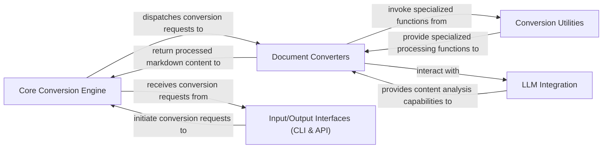

## Details

The feedback is highly relevant and actionable as it points out a critical missing piece in the previous analysis: the lack of specific source file references for the identified components. This prevents proper validation and understanding of the architectural mapping to the actual codebase. Therefore, architectural changes are required to incorporate these references. I will update the analysis by identifying the specific source files or modules corresponding to each abstract component.

### Core Conversion Engine
The central orchestrator managing the conversion workflow, input handling, converter selection, and output generation.

**Related Classes/Methods**:

- <a href="https://github.com/microsoft/markitdown/blob/main/packages/markitdown/src/markitdown/_markitdown.py#L1-L1" target="_blank" rel="noopener noreferrer">`packages/markitdown/src/markitdown/_markitdown.py` (1:1)</a>

### Document Converters
Specialized modules responsible for converting various document formats into a unified markdown representation.

**Related Classes/Methods**:

- <a href="https://github.com/microsoft/markitdown/blob/main/packages/markitdown/src/markitdown/converters/#L1-L1" target="_blank" rel="noopener noreferrer">`packages/markitdown/src/markitdown/converters/` (1:1)</a>

### Input/Output Interfaces (CLI & API)
External interfaces providing command-line and web API access for users and other systems to initiate conversions.

**Related Classes/Methods**:

- <a href="https://github.com/microsoft/markitdown/blob/main/packages/markitdown/src/markitdown/__main__.py#L1-L1" target="_blank" rel="noopener noreferrer">`packages/markitdown/src/markitdown/__main__.py` (1:1)</a>

### LLM Integration
Provides functionalities to integrate Large Language Models for advanced content analysis and enrichment during conversion.

**Related Classes/Methods**:

- <a href="https://github.com/microsoft/markitdown/blob/main/packages/markitdown/src/markitdown/converters/_llm_caption.py#L1-L1" target="_blank" rel="noopener noreferrer">`packages/markitdown/src/markitdown/converters/_llm_caption.py` (1:1)</a>

### Conversion Utilities
Specialized helper modules offering format-specific processing capabilities, such as DOCX mathematical equation conversion.

**Related Classes/Methods**:

- <a href="https://github.com/microsoft/markitdown/blob/main/packages/markitdown/src/markitdown/converter_utils/#L1-L1" target="_blank" rel="noopener noreferrer">`packages/markitdown/src/markitdown/converter_utils/` (1:1)</a>

### [FAQ](https://github.com/CodeBoarding/GeneratedOnBoardings/tree/main?tab=readme-ov-file#faq)