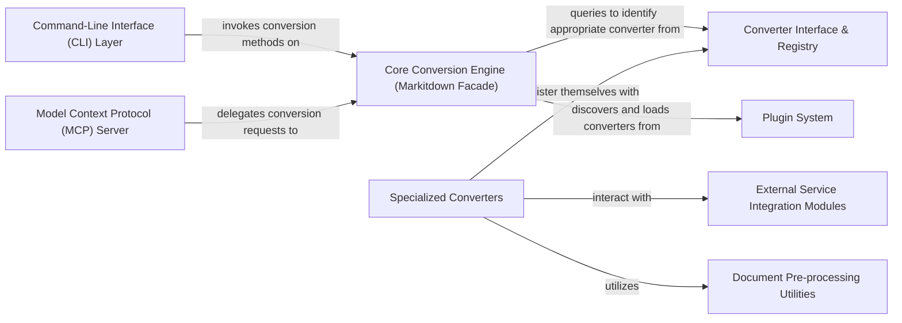

## Details

The `markitdown` architecture is centered around a `Core Conversion Engine` that acts as a facade, orchestrating document conversions. This engine receives requests from either the `Command-Line Interface (CLI) Layer` or the `Model Context Protocol (MCP) Server`. It leverages a `Converter Interface & Registry` to dynamically select the appropriate `Specialized Converters` for various document formats. These specialized converters perform the actual format-specific conversion, often relying on `Document Pre-processing Utilities` for complex parsing and integrating with `External Service Integration Modules` for advanced functionalities like LLM-based content analysis. The system's extensibility is a key feature, enabled by a `Plugin System` that allows for the dynamic discovery and loading of new or custom converters, making `markitdown` a flexible and adaptable tool for diverse document processing needs.

### Core Conversion Engine (Markitdown Facade)
The central orchestrator of the document conversion workflow, managing input, selecting converters, and dispatching tasks. It acts as the primary interface for clients and handles converter/plugin registration.

**Related Classes/Methods**:

- <a href="https://github.com/microsoft/markitdown/blob/main/packages/markitdown/src/markitdown/_markitdown.py" target="_blank" rel="noopener noreferrer">`packages.markitdown.src.markitdown._markitdown.Markitdown`</a>
- <a href="https://github.com/microsoft/markitdown/blob/main/packages/markitdown/src/markitdown/_markitdown.py" target="_blank" rel="noopener noreferrer">`packages.markitdown.src.markitdown._markitdown.convert`</a>

### Converter Interface & Registry
Defines the standard `accepts` and `convert` interface for all document converters and maintains a registry for dynamic discovery and selection by the Core Conversion Engine.

**Related Classes/Methods**:

- <a href="https://github.com/microsoft/markitdown/blob/main/packages/markitdown/src/markitdown/_base_converter.py" target="_blank" rel="noopener noreferrer">`packages.markitdown.src.markitdown._base_converter.accepts`</a>
- <a href="https://github.com/microsoft/markitdown/blob/main/packages/markitdown/src/markitdown/_base_converter.py" target="_blank" rel="noopener noreferrer">`packages.markitdown.src.markitdown._base_converter.convert`</a>

### Specialized Converters
Implement the `IDocumentConverter` interface to handle the conversion of specific document formats (e.g., PDF, DOCX, HTML, Image) into a unified Markdown output.

**Related Classes/Methods**:

- <a href="https://github.com/microsoft/markitdown/blob/main/packages/markitdown/src/markitdown/converters/_pdf_converter.py" target="_blank" rel="noopener noreferrer">`packages.markitdown.src.markitdown.converters._pdf_converter.convert`</a>
- <a href="https://github.com/microsoft/markitdown/blob/main/packages/markitdown/src/markitdown/converters/_docx_converter.py" target="_blank" rel="noopener noreferrer">`packages.markitdown.src.markitdown.converters._docx_converter.convert`</a>

### External Service Integration Modules
Encapsulate logic for interacting with external APIs like Azure Document Intelligence or Large Language Models (LLMs) for advanced document analysis, utilized by Specialized Converters.

**Related Classes/Methods**:

- <a href="https://github.com/microsoft/markitdown/blob/main/packages/markitdown/src/markitdown/converters/_doc_intel_converter.py" target="_blank" rel="noopener noreferrer">`packages.markitdown.src.markitdown.converters._doc_intel_converter.convert`</a>
- <a href="https://github.com/microsoft/markitdown/blob/main/packages/markitdown/src/markitdown/converters/_image_converter.py" target="_blank" rel="noopener noreferrer">`packages.markitdown.src.markitdown.converters._image_converter._get_llm_description`</a>

### Document Pre-processing Utilities
Provides specialized functions for preparing document content before conversion, particularly for complex formats requiring specific structural handling (e.g., mathematical equations in DOCX).

**Related Classes/Methods**:

- <a href="https://github.com/microsoft/markitdown/blob/main/packages/markitdown/src/markitdown/converter_utils/docx/pre_process.py" target="_blank" rel="noopener noreferrer">`packages.markitdown.src.markitdown.converter_utils.docx.pre_process.pre_process_docx`</a>
- <a href="https://github.com/microsoft/markitdown/blob/main/packages/markitdown/src/markitdown/converter_utils/docx/math/omml.py" target="_blank" rel="noopener noreferrer">`packages.markitdown.src.markitdown.converter_utils.docx.math.omml.latex`</a>

### Command-Line Interface (CLI) Layer
Offers a user-friendly command-line interface for direct interaction with the Markitdown core library, acting as a thin wrapper around the Core Conversion Engine.

**Related Classes/Methods**:

- <a href="https://github.com/microsoft/markitdown/blob/main/packages/markitdown/src/markitdown/__main__.py" target="_blank" rel="noopener noreferrer">`packages.markitdown.src.markitdown.__main__.main`</a>

### Model Context Protocol (MCP) Server
Exposes Markitdown's conversion capabilities as a web service (using Starlette), enabling programmatic access and integration with other systems.

**Related Classes/Methods**:

- <a href="https://github.com/microsoft/markitdown/blob/main/packages/markitdown-mcp/src/markitdown_mcp/__main__.py" target="_blank" rel="noopener noreferrer">`packages.markitdown-mcp.src.markitdown_mcp.__main__.main`</a>

### Plugin System
Provides the mechanism for extending Markitdown's capabilities by allowing developers to create and integrate custom converters as external plugins, managing their discovery and loading.

**Related Classes/Methods**:

- <a href="https://github.com/microsoft/markitdown/blob/main/packages/markitdown/src/markitdown/_markitdown.py" target="_blank" rel="noopener noreferrer">`packages.markitdown.src.markitdown._markitdown.enable_plugins`</a>
- <a href="https://github.com/microsoft/markitdown/blob/main/packages/markitdown/src/markitdown/_markitdown.py" target="_blank" rel="noopener noreferrer">`packages.markitdown.src.markitdown._markitdown._load_plugins`</a>

### [FAQ](https://github.com/CodeBoarding/GeneratedOnBoardings/tree/main?tab=readme-ov-file#faq)