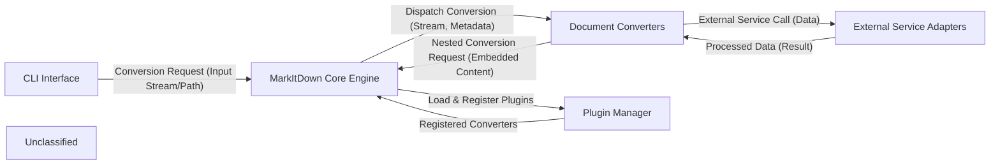

## Details

The MarkItDown project is structured around a core conversion engine that processes various document formats into Markdown. The system initiates through a Command Line Interface (CLI) which handles user input and dispatches conversion requests to the MarkItDown Core Engine. This engine orchestrates the conversion process, leveraging a collection of specialized Document Converters. These converters are responsible for transforming specific input formats, often interacting with External Service Adapters for advanced functionalities like OCR or metadata extraction. The system also incorporates a Plugin Manager to dynamically extend its conversion capabilities with external plugins. This modular design ensures flexibility, extensibility, and clear separation of concerns, making it suitable for both documentation and visual diagram generation.

### CLI Interface
The primary user interaction point for initiating document conversion tasks, parsing commands, and managing input/output.

**Related Classes/Methods**:

- <a href="https://github.com/microsoft/markitdown/blob/main/packages/markitdown/src/markitdown/__main__.py#L1-L1000" target="_blank" rel="noopener noreferrer">`packages/markitdown/src/markitdown/__main__.py`:1-1000</a>

### MarkItDown Core Engine
The central orchestrator of the MarkItDown library, responsible for managing the overall conversion workflow, input stream analysis, and dispatching to appropriate converters.

**Related Classes/Methods**:

- <a href="https://github.com/microsoft/markitdown/blob/main/packages/markitdown/src/markitdown/_markitdown.py#L1-L1000" target="_blank" rel="noopener noreferrer">`packages/markitdown/src/markitdown/_markitdown.py`:1-1000</a>

### Document Converters
A collection of specialized modules designed to convert various document formats (e.g., CSV, HTML, PPTX, EPUB) into Markdown, including internal pre-processing utilities.

**Related Classes/Methods**:

- <a href="https://github.com/microsoft/markitdown/blob/main/packages/markitdown/src/markitdown/converters/_csv_converter.py#L1-L1000" target="_blank" rel="noopener noreferrer">`packages/markitdown/src/markitdown/converters/_csv_converter.py`:1-1000</a>
- <a href="https://github.com/microsoft/markitdown/blob/main/packages/markitdown/src/markitdown/converters/_docx_converter.py#L1-L1000" target="_blank" rel="noopener noreferrer">`packages/markitdown/src/markitdown/converters/_docx_converter.py`:1-1000</a>

### Plugin Manager
Manages the discovery, loading, and registration of external converter plugins, enabling the extension of MarkItDown's conversion capabilities.

**Related Classes/Methods**:

- <a href="https://github.com/microsoft/markitdown/blob/main/packages/markitdown/src/markitdown/_markitdown.py" target="_blank" rel="noopener noreferrer">`_markitdown.py:_load_plugins`</a>
- <a href="https://github.com/microsoft/markitdown/blob/main/packages/markitdown/src/markitdown/_markitdown.py" target="_blank" rel="noopener noreferrer">`_markitdown.py:_register_converter`</a>

### External Service Adapters
Components responsible for integrating with and abstracting external services such as Azure Document Intelligence for OCR, Large Language Models for image descriptions, and the YouTube API for video metadata.

**Related Classes/Methods**:

- <a href="https://github.com/microsoft/markitdown/blob/main/packages/markitdown/src/markitdown/converters/_doc_intel_converter.py#L1-L1000" target="_blank" rel="noopener noreferrer">`packages/markitdown/src/markitdown/converters/_doc_intel_converter.py`:1-1000</a>

### Unclassified
Component for all unclassified files and utility functions (Utility functions/External Libraries/Dependencies)

**Related Classes/Methods**: _None_

### [FAQ](https://github.com/CodeBoarding/GeneratedOnBoardings/tree/main?tab=readme-ov-file#faq)