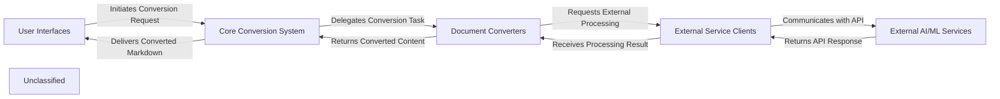

## Details

The `markitdown` project is structured around a pluggable document conversion pipeline. User interactions, whether via a Command-Line Interface (CLI) or a web-based API, are handled by the `User Interfaces` component, which initiates conversion requests. The `Core Conversion System` acts as the central orchestrator, dynamically selecting and invoking specialized `Document Converters` based on the input document type. These converters are responsible for transforming various formats into Markdown. For advanced processing, certain `Document Converters` interact with `External Service Clients`, which abstract communication with `External AI/ML Services` like Azure Document Intelligence and Large Language Models. The converted Markdown content is then returned through the system back to the `User Interfaces`.

### User Interfaces
Provides the primary interaction points for users, encompassing both a Command-Line Interface (CLI) for direct execution and a web-based API server (MCP Server) for programmatic access. It is responsible for receiving user input, initiating conversion requests, and handling the final presentation or delivery of the converted Markdown content.

**Related Classes/Methods**:

- <a href="https://github.com/microsoft/markitdown/blob/mainpackages/markitdown/src/markitdown/__main__.py#L13-L200" target="_blank" rel="noopener noreferrer">`markitdown.__main__.main`:13-200</a>
- <a href="https://github.com/microsoft/markitdown/blob/mainpackages/markitdown-mcp/src/markitdown_mcp/__main__.py#L82-L123" target="_blank" rel="noopener noreferrer">`markitdown_mcp.__main__.main`:82-123</a>

### Core Conversion System
The central orchestrator of the `markitdown` project. It manages the entire document conversion pipeline, including selecting the appropriate converter based on input type, analyzing input streams, and dynamically loading and registering both built-in and external plugin-based `Document Converters`.

**Related Classes/Methods**:

- <a href="https://github.com/microsoft/markitdown/blob/mainpackages/markitdown/src/markitdown/_markitdown.py#L93-L776" target="_blank" rel="noopener noreferrer">`markitdown._markitdown.MarkItDown`:93-776</a>

### Document Converters
A collection of specialized, pluggable modules designed to convert various document and content formats (e.g., DOCX, images, web content, archives) into Markdown. Each converter encapsulates format-specific parsing logic and can leverage internal processing or interact with external services for advanced transformations.

**Related Classes/Methods**:

- <a href="https://github.com/microsoft/markitdown/blob/mainpackages/markitdown/src/markitdown/converters/_doc_intel_converter.py" target="_blank" rel="noopener noreferrer">`markitdown.converters.DocumentIntelligenceConverter`</a>
- <a href="https://github.com/microsoft/markitdown/blob/mainpackages/markitdown/src/markitdown/converters/_image_converter.py" target="_blank" rel="noopener noreferrer">`markitdown.converters.ImageConverter`</a>
- <a href="https://github.com/microsoft/markitdown/blob/mainpackages/markitdown/src/markitdown/converter_utils/docx/pre_process.py#L118-L156" target="_blank" rel="noopener noreferrer">`markitdown.converter_utils.docx.pre_process.pre_process_docx`:118-156</a>
- <a href="https://github.com/microsoft/markitdown/blob/mainpackages/markitdown/src/markitdown/converters/_youtube_converter.py" target="_blank" rel="noopener noreferrer">`markitdown.converters.YouTubeConverter`</a>
- <a href="https://github.com/microsoft/markitdown/blob/mainpackages/markitdown/src/markitdown/converters/_zip_converter.py" target="_blank" rel="noopener noreferrer">`markitdown.converters.ZipConverter`</a>
- <a href="https://github.com/microsoft/markitdown/blob/mainpackages/markitdown-sample-plugin/src/markitdown_sample_plugin/_plugin.py#L34-L71" target="_blank" rel="noopener noreferrer">`markitdown_sample_plugin._plugin.RtfConverter`:34-71</a>

### External Service Clients
This component provides a standardized interface for `Document Converters` to interact with external cloud-based AI/ML services. It abstracts away the complexities of API communication, authentication, and request/response handling for these services.

**Related Classes/Methods**:

- `azure.ai.documentintelligence.DocumentIntelligenceClient`
- `openai.OpenAI`

### External AI/ML Services
Represents external cloud-based AI/ML services, such as Large Language Models (LLMs) for advanced natural language processing (e.g., generating descriptive text) and Azure Document Intelligence for comprehensive document analysis, optical character recognition (OCR), and data extraction.

**Related Classes/Methods**:

### Unclassified
Component for all unclassified files and utility functions (Utility functions/External Libraries/Dependencies)

**Related Classes/Methods**: _None_

### [FAQ](https://github.com/CodeBoarding/GeneratedOnBoardings/tree/main?tab=readme-ov-file#faq)