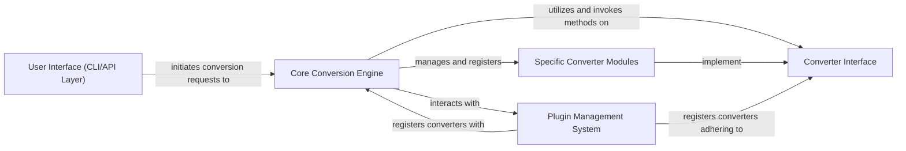

## Details

The `markitdown` architecture is designed as a modular data transformation utility, centered around a `Core Conversion Engine` that acts as a Facade. User interactions originate from the `User Interface (CLI/API Layer)`, which dispatches conversion requests to this central engine. The `Core Conversion Engine` dynamically selects and orchestrates `Specific Converter Modules` based on the input type, all of which adhere to a common `Converter Interface` (implementing a Strategy Pattern). This design promotes flexibility and extensibility, further enhanced by a `Plugin Management System` that allows for the seamless integration of new, custom converter modules, ensuring the system can adapt to a wide array of document and data formats.

### User Interface (CLI/API Layer)
Provides the primary entry points for user interaction, handling command-line arguments and exposing conversion functionalities via an API.

**Related Classes/Methods**:

- <a href="https://github.com/microsoft/markitdown/blob/main/packages/markitdown/src/markitdown/__main__.py" target="_blank" rel="noopener noreferrer">`packages.markitdown.src.markitdown.__main__.main` (1:1)</a>
- <a href="https://github.com/microsoft/markitdown/blob/main/packages/markitdown-mcp/src/markitdown_mcp/__main__.py" target="_blank" rel="noopener noreferrer">`packages.markitdown-mcp.src.markitdown_mcp.__main__.convert_to_markdown` (1:1)</a>

### Core Conversion Engine
The central orchestrator that manages the lifecycle of converters, dispatches conversion requests, and coordinates the overall data flow, acting as a Facade to the underlying conversion logic.

**Related Classes/Methods**:

- `packages.markitdown.src.markitdown._markitdown.__init__` (1:1)
- <a href="https://github.com/microsoft/markitdown/blob/main/packages/markitdown/src/markitdown/_markitdown.py" target="_blank" rel="noopener noreferrer">`packages.markitdown.src.markitdown._markitdown.convert` (1:1)</a>

### Converter Interface
Defines the standard contract (e.g., `accepts`, `convert` methods) that all specific converter implementations must adhere to, enabling a Strategy Pattern for content conversion.

**Related Classes/Methods**:

- <a href="https://github.com/microsoft/markitdown/blob/main/packages/markitdown/src/markitdown/_base_converter.py" target="_blank" rel="noopener noreferrer">`packages.markitdown.src.markitdown._base_converter.accepts` (1:1)</a>
- <a href="https://github.com/microsoft/markitdown/blob/main/packages/markitdown/src/markitdown/_base_converter.py" target="_blank" rel="noopener noreferrer">`packages.markitdown.src.markitdown._base_converter.convert` (1:1)</a>

### Specific Converter Modules
A collection of specialized modules, each implementing the `Converter Interface` to handle the conversion of specific document types or data formats into markdown.

**Related Classes/Methods**:

- <a href="https://github.com/microsoft/markitdown/blob/main/packages/markitdown/src/markitdown/converters/_doc_intel_converter.py" target="_blank" rel="noopener noreferrer">`packages.markitdown.src.markitdown.converters._doc_intel_converter.convert` (1:1)</a>
- <a href="https://github.com/microsoft/markitdown/blob/main/packages/markitdown/src/markitdown/converters/_image_converter.py" target="_blank" rel="noopener noreferrer">`packages.markitdown.src.markitdown.converters._image_converter.convert` (1:1)</a>
- <a href="https://github.com/microsoft/markitdown/blob/main/packages/markitdown/src/markitdown/converters/_html_converter.py" target="_blank" rel="noopener noreferrer">`packages.markitdown.src.markitdown.converters._html_converter.convert` (1:1)</a>
- <a href="https://github.com/microsoft/markitdown/blob/main/packages/markitdown/src/markitdown/converters/_docx_converter.py" target="_blank" rel="noopener noreferrer">`packages.markitdown.src.markitdown.converters._docx_converter.convert` (1:1)</a>

### Plugin Management System
Facilitates the discovery, loading, and registration of external converter plugins, enabling extensibility of the Markitdown system.

**Related Classes/Methods**:

- <a href="https://github.com/microsoft/markitdown/blob/main/packages/markitdown/src/markitdown/_markitdown.py" target="_blank" rel="noopener noreferrer">`packages.markitdown.src.markitdown._markitdown.enable_plugins` (1:1)</a>

### [FAQ](https://github.com/CodeBoarding/GeneratedOnBoardings/tree/main?tab=readme-ov-file#faq)