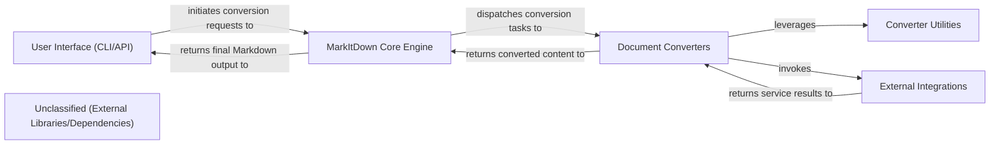

## Details

The MarkItDown project is structured around a clear separation of concerns, facilitating robust document conversion. User interactions, whether via the Command Line Interface (CLI) or a potential API, are handled by the User Interface component. This component then delegates conversion tasks to the MarkItDown Core Engine, which acts as the central orchestrator. The Core Engine dynamically utilizes various Document Converters, each specialized for a particular input format. These converters, in turn, rely on a suite of Converter Utilities for common tasks and may interact with External Integrations for advanced functionalities like AI processing or metadata extraction.

### User Interface (CLI/API)
The primary entry point for users, encompassing both the command-line interface and the optional web API for conversion requests.

**Related Classes/Methods**:

- <a href="https://github.com/microsoft/markitdown/blob/main/packages/markitdown/src/markitdown/__main__.py#L13-L200" target="_blank" rel="noopener noreferrer">`main`:13-200</a>
- <a href="https://github.com/microsoft/markitdown/blob/main/codeboarding-rewrite/src/cli.ts" target="_blank" rel="noopener noreferrer">`runConversion`</a>
- <a href="https://github.com/microsoft/markitdown/blob/main/codeboarding-rewrite/src/mcp-server.ts" target="_blank" rel="noopener noreferrer">`startServer`</a>

### MarkItDown Core Engine
The central facade orchestrating the entire conversion process. It handles input/output management, discovers and registers converters, and dispatches conversion tasks to the appropriate Document Converters.

**Related Classes/Methods**:

- <a href="https://github.com/microsoft/markitdown/blob/main/packages/markitdown/src/markitdown/__main__.py" target="_blank" rel="noopener noreferrer">`MarkItDown`</a>
- <a href="https://github.com/microsoft/markitdown/blob/main/codeboarding-rewrite/src/core/markitdown.ts" target="_blank" rel="noopener noreferrer">`MarkItDown:convertBuffer`</a>

### Document Converters
A modular collection of specialized plugins, each responsible for transforming a specific input document format (e.g., HTML, CSV, Plain Text) into Markdown. They leverage Converter Utilities and potentially interact with External Integrations as needed.

**Related Classes/Methods**:

- <a href="https://github.com/microsoft/markitdown/blob/main/packages/markitdown/src/markitdown/_base_converter.py#L42-L105" target="_blank" rel="noopener noreferrer">`DocumentConverter`:42-105</a>
- <a href="https://github.com/microsoft/markitdown/blob/main/codeboarding-rewrite/src/types/converter.ts" target="_blank" rel="noopener noreferrer">`DocumentConverter:accepts`</a>
- <a href="https://github.com/microsoft/markitdown/blob/main/codeboarding-rewrite/src/types/converter.ts" target="_blank" rel="noopener noreferrer">`DocumentConverter:convert`</a>

### Converter Utilities
A set of shared helper modules providing common functionalities like stream information handling and URI parsing, used by Document Converters.

**Related Classes/Methods**:

- <a href="https://github.com/microsoft/markitdown/blob/main/codeboarding-rewrite/src/types/stream-info.ts" target="_blank" rel="noopener noreferrer">`createStreamInfo`</a>
- <a href="https://github.com/microsoft/markitdown/blob/main/codeboarding-rewrite/src/utils/uri-utils.ts" target="_blank" rel="noopener noreferrer">`parseDataUri`</a>

### External Integrations
Components responsible for interfacing with external services such as Large Language Models (LLMs) for AI-generated content, Azure AI Document Intelligence for advanced parsing, ExifTool for metadata extraction, and various web services for fetching remote content.

**Related Classes/Methods**: _None_

### Unclassified (External Libraries/Dependencies)
This component groups all external libraries and third-party dependencies that the project relies on but are not part of the core application logic.

**Related Classes/Methods**: _None_

### [FAQ](https://github.com/CodeBoarding/GeneratedOnBoardings/tree/main?tab=readme-ov-file#faq)