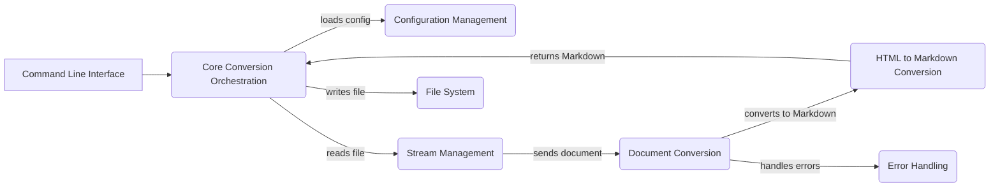

Okay, I will generate an onboarding document for the `markitdown` project based on the provided information.

**Project Description**

MarkItDown is a versatile tool designed to convert various document formats, such as DOCX, PDF, HTML, and more, into Markdown. It provides a command-line interface for easy use and supports configuration options to customize the conversion process. The project aims to simplify the process of transforming documents into a lightweight and readable Markdown format, suitable for various applications like documentation, note-taking, and content creation.

**Flow Diagram**

**Component Descriptions**

*   **Core Conversion Orchestration:** This component serves as the central processing unit, managing the entire conversion workflow. It receives input from the command-line interface, loads configurations, orchestrates file reading and writing, and calls the appropriate document converters. It also handles the overall flow of data and error management.

*   **Document Conversion:** This component is responsible for converting various document formats into Markdown. It includes a base `DocumentConverter` class and specialized converters for different file types like DOCX, PDF, and HTML. Each converter implements the logic to extract content from its respective format and transform it into Markdown.

*   **Stream Management:** This component handles the input and output streams, including reading files and managing stream metadata such as filename, MIME type, and charset. It provides a consistent interface for accessing file content and ensures that the conversion process has the necessary information about the input stream.

*   **HTML to Markdown Conversion:** This component provides utilities for converting HTML content to Markdown format. It includes custom Markdownify functionality to handle specific HTML elements and ensure accurate conversion of HTML structures into Markdown.

*   **Error Handling:** This component defines custom exceptions for managing errors during file conversion. It provides a structured way to handle issues such as unsupported formats, missing dependencies, and failed conversion attempts, ensuring robust error reporting and preventing unexpected program termination.