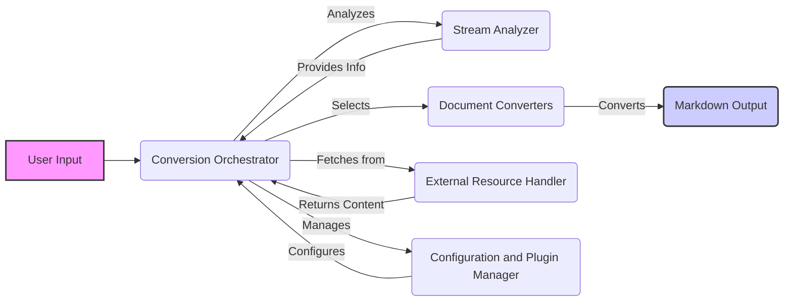

Okay, I will generate an onboarding document for the `markitdown` project based on the provided component descriptions.

**1. Project Description:**

Markitdown is a versatile tool designed to convert various document formats into Markdown. It supports local files, remote URLs, and streams as input. The core functionality involves analyzing the input, selecting the appropriate converter, and transforming the content into Markdown format. Markitdown also offers extensibility through plugins and customization options, making it adaptable to different conversion needs.

**2. Data Flow Diagram (Mermaid):**

**3. Component Descriptions:**

*   **User Input:** Represents the initial input to the system, which can be a local file, a URL, or a stream. It triggers the conversion process by sending the input to the Conversion Orchestrator.

*   **Conversion Orchestrator:** This is the central component that manages the entire conversion process. It receives input from the User Input or External Resource Handler, analyzes the stream type using the Stream Analyzer, selects the appropriate converter from the Document Converters, and manages configuration via the Configuration and Plugin Manager. Finally, it orchestrates the conversion and produces the Markdown Output.

*   **Stream Analyzer:** This component analyzes the input stream to determine its type and relevant metadata. It receives the stream from the Conversion Orchestrator and provides information back to the Orchestrator to aid in converter selection.

*   **Document Converters:** This component contains a collection of specialized converters for different document formats. The Conversion Orchestrator selects the appropriate converter based on the Stream Analyzer's output. The selected converter then transforms the document into Markdown, sending the result to the Markdown Output.

*   **External Resource Handler:** This component handles fetching content from external resources such as URLs. The Conversion Orchestrator uses it to retrieve content from remote sources, and the Handler returns the fetched content back to the Orchestrator.

*   **Configuration and Plugin Manager:** This component manages the configuration of the conversion process and allows for loading converters from plugins. The Conversion Orchestrator uses it to configure the conversion process, enabling or disabling built-in converters and loading plugins.

*   **Markdown Output:** Represents the final Markdown output generated by the Document Converters. This is the end result of the conversion process.