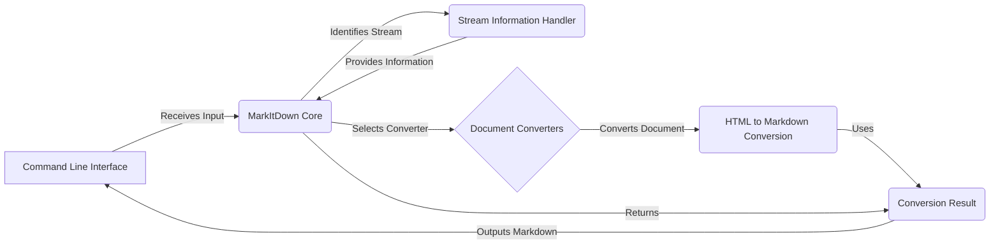

## MarkItDown: High-Level Data Flow Diagram

MarkItDown is a versatile document conversion tool that transforms various file formats and data sources into Markdown. It supports local files, remote URIs, and streams, automatically detecting the input type and applying the appropriate conversion logic.

## Component Descriptions

**A. Command Line Interface:** This is the entry point for users interacting with MarkItDown. It receives the input (file path, URI, or stream), passes it to the `MarkItDown Core`, and outputs the final Markdown content.

**B. MarkItDown Core:** The central orchestrator of the conversion process. It receives input from the CLI, uses the `Stream Information Handler` to identify the input type, selects the appropriate converter from the `Document Converters`, and returns the converted Markdown to the CLI. It relates to the `Stream Information Handler` by requesting stream information, and to the `Document Converters` by selecting and calling the appropriate converter.

**C. Stream Information Handler:** Responsible for analyzing the input stream and determining its type (e.g., file extension, MIME type). It provides this information to the `MarkItDown Core`, enabling it to select the correct converter. It relates to the `MarkItDown Core` by providing stream information, and to the `Document Converters` by helping the core select the right converter.

**D. Document Converters:** A collection of specialized converters, each designed to handle a specific document type (e.g., DOCX, PDF, HTML). The `MarkItDown Core` selects and invokes the appropriate converter based on the stream information. It relates to the `MarkItDown Core` by performing the actual conversion, and to the `HTML to Markdown Conversion` by using it to convert HTML content to Markdown.

**E. HTML to Markdown Conversion:** Provides utilities to convert HTML content to Markdown format. It's used by several converters to handle HTML-based content. It relates to the `Document Converters` by providing HTML to Markdown conversion services, and to the `Conversion Result` by contributing to the final Markdown output.

**F. Conversion Result:** Represents the final output of the conversion process, containing the converted Markdown content. It's returned by the `MarkItDown Core` and displayed to the user via the CLI. It relates to the `MarkItDown Core` by being the final result of the conversion, and to the `Command Line Interface` by providing the output to be displayed.
