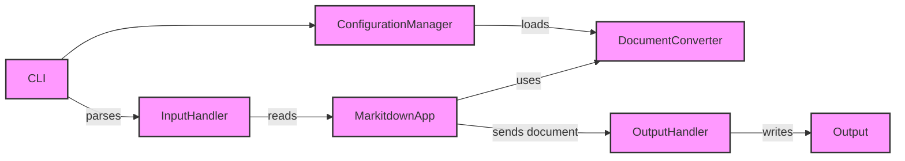

Okay, I will generate an onboarding document for the `markitdown` project based on the provided information.

**Project Description**

Markitdown is a versatile command-line tool designed to convert markdown files into various other formats, such as HTML, RTF, and more. It provides a flexible and extensible architecture that allows users to easily add new output formats via plugins. The core functionality involves parsing markdown input, converting it using registered converters, and writing the output to a specified file or standard output.

**Flow Diagram (Mermaid)**

**Component Descriptions**

*   **CLI:** The Command Line Interface component is responsible for parsing command-line arguments provided by the user. It determines the input file, output format, and any other specified options. It then passes this information to the `ConfigurationManager` and `InputHandler` to initiate the conversion process.

*   **ConfigurationManager:** This component manages the application's configuration. It loads settings from configuration files or command-line arguments, registers available document converters, and handles plugin loading. It provides the `MarkitdownApp` with the necessary configuration for the conversion process.

*   **InputHandler:** The `InputHandler` component is responsible for reading the input markdown file. It determines the input stream's information, such as filename, mimetype, and charset, and passes the content to the `MarkitdownApp`.

*   **MarkitdownApp:** This is the central application component that orchestrates the entire conversion process. It receives the input from the `InputHandler`, utilizes the appropriate `DocumentConverter` based on the configuration, and sends the converted document to the `OutputHandler`.

*   **DocumentConverter:** This component serves as an abstract base class and registry for document converters. It defines the interface for converting documents between different formats and manages the available converters. The `MarkitdownApp` uses this component to perform the actual conversion.

*   **OutputHandler:** The `OutputHandler` component handles writing the converted output to a file or standard output. It receives the converted document from the `MarkitdownApp` and writes it to the specified destination.

*   **Output:** Represents the final output of the conversion process, whether it's a file or standard output.