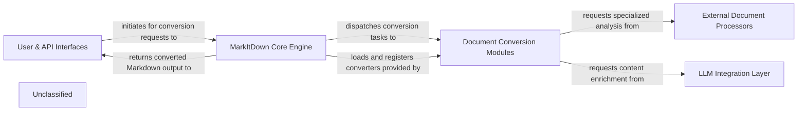

## Details

The MarkItDown project is structured around a core conversion engine that processes various document types into Markdown. It provides both a command-line interface and an MCP (Multi-Capability Protocol) server for interaction. The system is designed with extensibility in mind, allowing for the integration of third-party plugins and leveraging external services like Azure Document Intelligence and LLMs for enhanced document processing. Data flows from user input or external URIs through the core engine, which dispatches tasks to specialized converters. These converters may interact with external processors or LLMs before returning the converted Markdown output.

### User & API Interfaces
Provides the primary entry points for users and external systems to interact with MarkItDown, handling command-line arguments and HTTP API requests.

**Related Classes/Methods**:

- <a href="https://github.com/microsoft/markitdown/blob/mainpackages/markitdown/src/markitdown/__main__.py#L13-L200" target="_blank" rel="noopener noreferrer">`markitdown.__main__.main`:13-200</a>
- <a href="https://github.com/microsoft/markitdown/blob/mainpackages/markitdown-mcp/src/markitdown_mcp/__main__.py#L82-L123" target="_blank" rel="noopener noreferrer">`markitdown_mcp.__main__.main`:82-123</a>

### MarkItDown Core Engine
The central orchestrator of the MarkItDown system, managing the conversion pipeline, loading converters (including plugins), dispatching conversion tasks, and maintaining input stream context.

**Related Classes/Methods**:

- <a href="https://github.com/microsoft/markitdown/blob/mainpackages/markitdown/src/markitdown/_markitdown.py#L93-L776" target="_blank" rel="noopener noreferrer">`markitdown._markitdown.MarkItDown`:93-776</a>
- <a href="https://github.com/microsoft/markitdown/blob/mainpackages/markitdown/src/markitdown/_stream_info.py#L5-L32" target="_blank" rel="noopener noreferrer">`markitdown._stream_info.StreamInfo`:5-32</a>

### Document Conversion Modules
A pluggable system of specialized modules, each responsible for converting a specific document type (e.g., Image, HTML, PPTX) into Markdown. This component also encompasses the Plugin Manager for extensibility.

**Related Classes/Methods**:

- <a href="https://github.com/microsoft/markitdown/blob/mainpackages/markitdown-sample-plugin/src/markitdown_sample_plugin/_plugin.py#L25-L31" target="_blank" rel="noopener noreferrer">`markitdown_sample_plugin._plugin.register_converters`:25-31</a>
- <a href="https://github.com/microsoft/markitdown/blob/mainpackages/markitdown-sample-plugin/src/markitdown_sample_plugin/_plugin.py#L34-L71" target="_blank" rel="noopener noreferrer">`markitdown_sample_plugin._plugin.RtfConverter`:34-71</a>

### External Document Processors
Integrates with external services and utilities for advanced document analysis, metadata extraction, and specialized content transformations (e.g., Azure Document Intelligence for OCR, ExifTool for metadata, DOCX Math conversion).

**Related Classes/Methods**:

- <a href="https://github.com/microsoft/markitdown/blob/mainpackages/markitdown/src/markitdown/converters/_doc_intel_converter.py#L130-L254" target="_blank" rel="noopener noreferrer">`markitdown.converters._doc_intel_converter.DocumentIntelligenceConverter`:130-254</a>
- <a href="https://github.com/microsoft/markitdown/blob/mainpackages/markitdown/src/markitdown/converters/_exiftool.py#L11-L52" target="_blank" rel="noopener noreferrer">`markitdown.converters._exiftool.exiftool_metadata`:11-52</a>
- <a href="https://github.com/microsoft/markitdown/blob/mainpackages/markitdown/src/markitdown/converter_utils/docx/math/omml.py#L170-L400" target="_blank" rel="noopener noreferrer">`markitdown.converter_utils.docx.math.omml.oMath2Latex`:170-400</a>

### LLM Integration Layer
Provides an interface for enriching converted document content by interacting with Large Language Models, such as generating descriptions or summaries. This layer abstracts the underlying LLM framework.

**Related Classes/Methods**:

- <a href="https://github.com/microsoft/markitdown/blob/mainpackages/markitdown/src/markitdown/converters/_image_converter.py" target="_blank" rel="noopener noreferrer">`markitdown.converters._image_converter.ImageConverter._get_llm_description`</a>
- <a href="https://github.com/microsoft/markitdown/blob/mainpackages/markitdown/src/markitdown/converters/_image_converter.py#L16-L138" target="_blank" rel="noopener noreferrer">`markitdown.converters._image_converter.ImageConverter`:16-138</a>

### Unclassified
Component for all unclassified files and utility functions (Utility functions/External Libraries/Dependencies)

**Related Classes/Methods**: _None_

### [FAQ](https://github.com/CodeBoarding/GeneratedOnBoardings/tree/main?tab=readme-ov-file#faq)