```mermaid
graph LR
    Entry_Points["Entry Points"]
    MarkItDown_Core_Facade_Plugin_Manager_["MarkItDown Core (Facade & Plugin Manager)"]
    Document_Conversion_Modules["Document Conversion Modules"]
    Conversion_Utilities["Conversion Utilities"]
    External_Service_Integrations["External Service Integrations"]
    External_Dependencies["External Dependencies"]
    Unclassified["Unclassified"]
    Entry_Points -- "Invokes conversion process" --> MarkItDown_Core_Facade_Plugin_Manager_
    MarkItDown_Core_Facade_Plugin_Manager_ -- "Dispatches conversion tasks; Registers converters" --> Document_Conversion_Modules
    Document_Conversion_Modules -- "Utilizes helper functions for processing" --> Conversion_Utilities
    Document_Conversion_Modules -- "Requests external data/processing" --> External_Service_Integrations
    External_Service_Integrations -- "Communicates with external APIs" --> External_Dependencies
    External_Dependencies -- "Returns data/results" --> External_Service_Integrations
    Conversion_Utilities -- "Returns processed data" --> Document_Conversion_Modules
    MarkItDown_Core_Facade_Plugin_Manager_ -- "Returns final result" --> Entry_Points
```

## Details

The `markitdown` project is designed with a clear separation of concerns, centered around a command-line interface that orchestrates document conversion. The `MarkItDown Core` acts as a central facade, managing various `Document Conversion Modules` and leveraging `Conversion Utilities` for data handling and external interactions. The data flow initiates with user input via the `Entry Points`, which then passes control to the `MarkItDown Core` for processing. The core dynamically selects and dispatches tasks to specialized `Document Conversion Modules`. These modules, in turn, utilize `Conversion Utilities` for common tasks, including interactions with `External Service Integrations` that abstract communication with `External Dependencies`. The final converted Markdown output is then routed back through the `MarkItDown Core` to the `Entry Points` for presentation.

### Entry Points
The primary interfaces for user interaction, including the command-line interface.

**Related Classes/Methods**:

- <a href="https://github.com/microsoft/markitdown/blob/main/packages/markitdown/src/markitdown/__main__.py#L13-L200" target="_blank" rel="noopener noreferrer">`main`:13-200</a>
- <a href="https://github.com/microsoft/markitdown/blob/main/codeboarding-rewrite/src/cli.ts" target="_blank" rel="noopener noreferrer">`runConversion`</a>

### MarkItDown Core (Facade & Plugin Manager)
The central orchestration engine and public API. It manages the discovery and registration of conversion plugins and dispatches conversion requests.

**Related Classes/Methods**:

- <a href="https://github.com/microsoft/markitdown/blob/main/packages/markitdown/src/markitdown/__main__.py" target="_blank" rel="noopener noreferrer">`MarkItDown`</a>
- <a href="https://github.com/microsoft/markitdown/blob/main/codeboarding-rewrite/src/core/markitdown.ts" target="_blank" rel="noopener noreferrer">`MarkItDown:registerConverter`</a>
- <a href="https://github.com/microsoft/markitdown/blob/main/codeboarding-rewrite/src/core/markitdown.ts" target="_blank" rel="noopener noreferrer">`MarkItDown:convertBuffer`</a>
- <a href="https://github.com/microsoft/markitdown/blob/main/codeboarding-rewrite/src/core/markitdown.ts" target="_blank" rel="noopener noreferrer">`MarkItDown:findConverter`</a>

### Document Conversion Modules
A collection of specialized modules, each responsible for converting a specific document format (e.g., Plain Text, HTML, CSV) into Markdown, adhering to a common interface.

**Related Classes/Methods**:

- <a href="https://github.com/microsoft/markitdown/blob/main/packages/markitdown/src/markitdown/converters/_plain_text_converter.py#L33-L71" target="_blank" rel="noopener noreferrer">`PlainTextConverter`:33-71</a>
- <a href="https://github.com/microsoft/markitdown/blob/main/packages/markitdown/src/markitdown/converters/_html_converter.py#L20-L90" target="_blank" rel="noopener noreferrer">`HtmlConverter`:20-90</a>
- <a href="https://github.com/microsoft/markitdown/blob/main/packages/markitdown/src/markitdown/converters/_csv_converter.py#L15-L77" target="_blank" rel="noopener noreferrer">`CsvConverter`:15-77</a>
- <a href="https://github.com/microsoft/markitdown/blob/main/codeboarding-rewrite/src/converters/plain-text-converter.ts" target="_blank" rel="noopener noreferrer">`codeboarding-rewrite/src/converters/plain-text-converter.ts`</a>

### Conversion Utilities
Helper functions and modules providing common utilities for document pre-processing, stream information handling, and specialized transformations used by various converters.

**Related Classes/Methods**:

- <a href="https://github.com/microsoft/markitdown/blob/main/codeboarding-rewrite/src/utils/uri-utils.ts" target="_blank" rel="noopener noreferrer">`readFromUri`</a>
- <a href="https://github.com/microsoft/markitdown/blob/main/codeboarding-rewrite/src/utils/uri-utils.ts" target="_blank" rel="noopener noreferrer">`parseDataUri`</a>
- <a href="https://github.com/microsoft/markitdown/blob/main/codeboarding-rewrite/src/utils/uri-utils.ts" target="_blank" rel="noopener noreferrer">`createStreamInfoFromUri`</a>

### External Service Integrations
Components responsible for abstracting and managing interactions with various external services, such as fetching content from HTTP/HTTPS URLs.

**Related Classes/Methods**:

- <a href="https://github.com/microsoft/markitdown/blob/main/codeboarding-rewrite/src/utils/uri-utils.ts" target="_blank" rel="noopener noreferrer">`readFromUri`</a>

### External Dependencies
Represents external services and APIs that `markitdown` integrates with but does not directly control. These are typically third-party libraries or external web services.

**Related Classes/Methods**:

### Unclassified
This component encompasses foundational types, interfaces, and exception definitions that are utilized across various modules but do not represent a distinct functional component. It also serves as a temporary grouping for any other files that require further classification.

**Related Classes/Methods**:

- <a href="https://github.com/microsoft/markitdown/blob/main/codeboarding-rewrite/src/types/converter.ts" target="_blank" rel="noopener noreferrer">`codeboarding-rewrite/src/types/converter.ts`</a>
- <a href="https://github.com/microsoft/markitdown/blob/main/codeboarding-rewrite/src/types/stream-info.ts" target="_blank" rel="noopener noreferrer">`codeboarding-rewrite/src/types/stream-info.ts`</a>
- <a href="https://github.com/microsoft/markitdown/blob/main/codeboarding-rewrite/src/types/exceptions.ts" target="_blank" rel="noopener noreferrer">`codeboarding-rewrite/src/types/exceptions.ts`</a>

### [FAQ](https://github.com/CodeBoarding/GeneratedOnBoardings/tree/main?tab=readme-ov-file#faq)