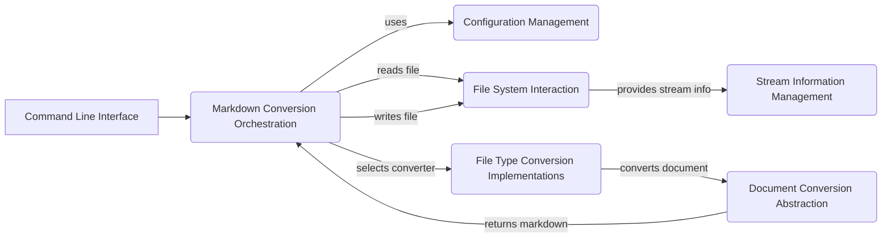

Okay, I will generate a markdown document that describes the `markitdown` project and its components, including a Mermaid flow diagram.

```markdown
## MarkItDown Project Description

MarkItDown is a versatile document conversion tool that transforms various file formats, such as DOCX, PDF, HTML, and more, into Markdown. It provides a command-line interface for easy use and supports configuration options to customize the conversion process. The project is designed to be extensible, allowing for the addition of new file type converters.

## Project Flow Diagram



## Component Descriptions

### Markdown Conversion Orchestration

This component orchestrates the entire markdown conversion process. It reads input files, loads configuration settings, selects the appropriate file type converter, and writes the converted Markdown output to a file. It acts as the central control point, managing the flow of data and delegating tasks to other components.

### Document Conversion Abstraction

This component defines the abstract base for all document converters and the structure of the conversion result. It provides a consistent interface for different file types, ensuring that all converters adhere to a common standard. This abstraction simplifies the process of adding new converters and promotes code reusability.

### File Type Conversion Implementations

This component provides concrete implementations for converting various file types (e.g., DOCX, PDF, HTML) to Markdown. Each converter is tailored to the specific file format, handling the unique challenges and complexities of that format. This component is responsible for the actual conversion logic, transforming the content of the input file into Markdown.

### Command-Line Interface

This component handles parsing command-line arguments and initiating the conversion process based on user input. It provides a user-friendly interface for interacting with the application, allowing users to specify input files, output files, and configuration options.

### Stream Information Management

This component encapsulates information about the input stream, including filename, MIME type, and charset. It facilitates consistent handling of input data, ensuring that the application can correctly interpret and process files regardless of their origin or format.
```