```mermaid
graph LR
    User_Interfaces_CLI_API_Gateway_["User Interfaces (CLI & API Gateway)"]
    Core_Conversion_Orchestrator["Core Conversion Orchestrator"]
    Input_Stream_Management["Input & Stream Management"]
    Document_Converter_Framework["Document Converter Framework"]
    Built_in_Document_Converters["Built-in Document Converters"]
    External_Service_Integrations["External Service Integrations"]
    Markdown_Output_Post_processing["Markdown Output & Post-processing"]
    Error_Handling_Exceptions["Error Handling & Exceptions"]
    Unclassified["Unclassified"]
    User_Interfaces_CLI_API_Gateway_ -- "initiates conversion requests to" --> Core_Conversion_Orchestrator
    User_Interfaces_CLI_API_Gateway_ -- "receives final Markdown output from" --> Markdown_Output_Post_processing
    User_Interfaces_CLI_API_Gateway_ -- "receives error notifications from" --> Error_Handling_Exceptions
    Core_Conversion_Orchestrator -- "utilizes for input standardization" --> Input_Stream_Management
    Core_Conversion_Orchestrator -- "dispatches conversion tasks to implementations" --> Document_Converter_Framework
    Core_Conversion_Orchestrator -- "reports errors to" --> Error_Handling_Exceptions
    Input_Stream_Management -- "provides standardized input to" --> Core_Conversion_Orchestrator
    Input_Stream_Management -- "reports input-related errors to" --> Error_Handling_Exceptions
    Document_Converter_Framework -- "is implemented by" --> Built_in_Document_Converters
    Document_Converter_Framework -- "is implemented by" --> External_Service_Integrations
    Document_Converter_Framework -- "reports conversion framework errors to" --> Error_Handling_Exceptions
    Built_in_Document_Converters -- "processes content and sends to" --> Markdown_Output_Post_processing
    Built_in_Document_Converters -- "reports conversion-specific errors to" --> Error_Handling_Exceptions
    External_Service_Integrations -- "sends processed content to" --> Markdown_Output_Post_processing
    External_Service_Integrations -- "reports external service errors to" --> Error_Handling_Exceptions
    Markdown_Output_Post_processing -- "generates final Markdown for" --> User_Interfaces_CLI_API_Gateway_
    Markdown_Output_Post_processing -- "reports rendering errors to" --> Error_Handling_Exceptions
    Error_Handling_Exceptions -- "propagates errors to" --> Core_Conversion_Orchestrator
    Core_Conversion_Orchestrator -- "propagates errors to" --> User_Interfaces_CLI_API_Gateway_
```

## Details

The `markitdown` project is structured around a `Core Conversion Orchestrator` that manages the conversion of various document formats into Markdown. User interaction occurs through the `User Interfaces (CLI & API Gateway)` component, which initiates conversion requests. The `Core Conversion Orchestrator` relies on the `Input & Stream Management` component to standardize diverse input sources. The core extensibility is provided by the `Document Converter Framework`, which defines the interface for all converters. Concrete implementations are found in `Built-in Document Converters` for local file processing and `External Service Integrations` for leveraging external AI/ML services. After conversion, the `Markdown Output & Post-processing` component refines the output into a clean Markdown format. Throughout this process, the `Error Handling & Exceptions` component ensures robust error management and reporting. This architecture facilitates a clear data flow from user input, through conversion and processing, to final Markdown output, with comprehensive error handling at each stage.

### User Interfaces (CLI & API Gateway)
Provides the primary interaction points for users and external systems, including a command-line interface for direct execution and a RESTful API gateway for programmatic access.

**Related Classes/Methods**:

- <a href="https://github.com/microsoft/markitdown//blobpackages/markitdown/src/markitdown/__main__.py#L13-L200" target="_blank" rel="noopener noreferrer">`markitdown.__main__.main`:13-200</a>
- <a href="https://github.com/microsoft/markitdown//blobpackages/markitdown-mcp/src/markitdown_mcp/__main__.py#L82-L123" target="_blank" rel="noopener noreferrer">`markitdown_mcp.__main__.main`:82-123</a>

### Core Conversion Orchestrator
The central brain of `markitdown`, managing the entire conversion lifecycle, including plugin discovery, registration, input dispatch, and overall workflow coordination.

**Related Classes/Methods**:

- <a href="https://github.com/microsoft/markitdown//blobpackages/markitdown/src/markitdown/_markitdown.py#L93-L776" target="_blank" rel="noopener noreferrer">`markitdown.MarkItDown`:93-776</a>

### Input & Stream Management
A foundational utility layer responsible for abstracting and standardizing various input sources (local files, diverse URIs, raw streams), extracting necessary metadata and preparing content for conversion.

**Related Classes/Methods**:

- <a href="https://github.com/microsoft/markitdown//blobpackages/markitdown/src/markitdown/_stream_info.py" target="_blank" rel="noopener noreferrer">`markitdown.StreamInfo`</a>
- <a href="https://github.com/microsoft/markitdown//blobpackages/markitdown/src/markitdown/_uri_utils.py#L8-L16" target="_blank" rel="noopener noreferrer">`markitdown._uri_utils.file_uri_to_path`:8-16</a>
- <a href="https://github.com/microsoft/markitdown//blobpackages/markitdown/src/markitdown/_uri_utils.py#L19-L52" target="_blank" rel="noopener noreferrer">`markitdown._uri_utils.parse_data_uri`:19-52</a>

### Document Converter Framework
Defines the abstract interface (`DocumentConverter`) and result structure (`DocumentConverterResult`) that all concrete document converters must adhere to, establishing the project's extensible plugin architecture.

**Related Classes/Methods**:

- <a href="https://github.com/microsoft/markitdown//blobpackages/markitdown/src/markitdown/_base_converter.py" target="_blank" rel="noopener noreferrer">`markitdown.DocumentConverter`</a>
- <a href="https://github.com/microsoft/markitdown//blobpackages/markitdown/src/markitdown/_base_converter.py" target="_blank" rel="noopener noreferrer">`markitdown.DocumentConverterResult`</a>

### Built-in Document Converters
A collection of specialized converters designed to process a wide array of common document and content formats (e.g., HTML, Office documents, PDFs, images, EPUB, Jupyter Notebooks, CSV, Plain Text, ZIP) primarily performing local content extraction.

**Related Classes/Methods**:

- <a href="https://github.com/microsoft/markitdown//blobpackages/markitdown/src/markitdown/converters/_html_converter.py" target="_blank" rel="noopener noreferrer">`markitdown.converters.HtmlConverter`</a>
- <a href="https://github.com/microsoft/markitdown//blobpackages/markitdown/src/markitdown/converters/_docx_converter.py" target="_blank" rel="noopener noreferrer">`markitdown.converters.DocxConverter`</a>
- <a href="https://github.com/microsoft/markitdown//blobpackages/markitdown/src/markitdown/converters/_pdf_converter.py" target="_blank" rel="noopener noreferrer">`markitdown.converters.PdfConverter`</a>
- <a href="https://github.com/microsoft/markitdown//blobpackages/markitdown/src/markitdown/converters/_image_converter.py" target="_blank" rel="noopener noreferrer">`markitdown.converters.ImageConverter`</a>
- <a href="https://github.com/microsoft/markitdown//blobpackages/markitdown/src/markitdown/converters/_epub_converter.py" target="_blank" rel="noopener noreferrer">`markitdown.converters.EpubConverter`</a>
- <a href="https://github.com/microsoft/markitdown//blobpackages/markitdown/src/markitdown/converters/_ipynb_converter.py" target="_blank" rel="noopener noreferrer">`markitdown.converters.IpynbConverter`</a>
- <a href="https://github.com/microsoft/markitdown//blobpackages/markitdown/src/markitdown/converters/_csv_converter.py" target="_blank" rel="noopener noreferrer">`markitdown.converters.CsvConverter`</a>
- <a href="https://github.com/microsoft/markitdown//blobpackages/markitdown/src/markitdown/converters/_plain_text_converter.py" target="_blank" rel="noopener noreferrer">`markitdown.converters.PlainTextConverter`</a>
- <a href="https://github.com/microsoft/markitdown//blobpackages/markitdown/src/markitdown/converters/_zip_converter.py" target="_blank" rel="noopener noreferrer">`markitdown.converters.ZipConverter`</a>

### External Service Integrations
This component comprises converters and utilities that leverage external AI/ML services and third-party APIs for advanced content processing, including Azure Document Intelligence, YouTube API, and external audio transcription services.

**Related Classes/Methods**:

- <a href="https://github.com/microsoft/markitdown//blobpackages/markitdown/src/markitdown/converters/_doc_intel_converter.py" target="_blank" rel="noopener noreferrer">`markitdown.converters.DocumentIntelligenceConverter`</a>
- <a href="https://github.com/microsoft/markitdown//blobpackages/markitdown/src/markitdown/converters/_youtube_converter.py" target="_blank" rel="noopener noreferrer">`markitdown.converters.YouTubeConverter`</a>
- <a href="https://github.com/microsoft/markitdown//blobpackages/markitdown/src/markitdown/converters/_audio_converter.py" target="_blank" rel="noopener noreferrer">`markitdown.converters.AudioConverter`</a>
- <a href="https://github.com/microsoft/markitdown//blobpackages/markitdown/src/markitdown/converters/_transcribe_audio.py#L23-L49" target="_blank" rel="noopener noreferrer">`markitdown.converters._transcribe_audio.transcribe_audio`:23-49</a>
- <a href="https://github.com/microsoft/markitdown//blobpackages/markitdown/src/markitdown/converters/_llm_caption.py#L7-L50" target="_blank" rel="noopener noreferrer">`markitdown.converters._llm_caption.llm_caption`:7-50</a>

### Markdown Output & Post-processing
Responsible for transforming intermediate content representations (often HTML-like structures) into a clean, standardized Markdown string, including specialized utilities for handling complex elements like Office Math Markup Language (OMML) equations.

**Related Classes/Methods**:

- <a href="https://github.com/microsoft/markitdown//blobpackages/markitdown/src/markitdown/converters/_markdownify.py#L8-L126" target="_blank" rel="noopener noreferrer">`markitdown.converters._markdownify._CustomMarkdownify`:8-126</a>
- <a href="https://github.com/microsoft/markitdown//blobpackages/markitdown/src/markitdown/converter_utils/docx/math/omml.py#L170-L400" target="_blank" rel="noopener noreferrer">`markitdown.converter_utils.docx.math.omml.oMath2Latex`:170-400</a>
- <a href="https://github.com/microsoft/markitdown//blobpackages/markitdown/src/markitdown/converter_utils/docx/pre_process.py#L118-L156" target="_blank" rel="noopener noreferrer">`markitdown.converter_utils.docx.pre_process.pre_process_docx`:118-156</a>

### Error Handling & Exceptions
Provides a structured and consistent mechanism for reporting and managing errors throughout the conversion process, defining custom exception classes for specific failure scenarios.

**Related Classes/Methods**:

- <a href="https://github.com/microsoft/markitdown//blobpackages/markitdown/src/markitdown/_exceptions.py" target="_blank" rel="noopener noreferrer">`markitdown.MarkItDownException`</a>

### Unclassified
Component for all unclassified files and utility functions (Utility functions/External Libraries/Dependencies)

**Related Classes/Methods**: _None_

### [FAQ](https://github.com/CodeBoarding/GeneratedOnBoardings/tree/main?tab=readme-ov-file#faq)