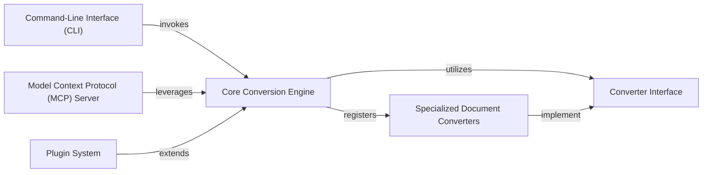

## Details

The feedback is highly relevant and valid. The original analysis provided a strong conceptual model but lacked the crucial concrete code references needed for verification. This requires an update to the analysis to include these references. No architectural changes are required, only an enrichment of the existing component definitions.

### Core Conversion Engine
The central orchestrator and facade for all document conversion operations.

**Related Classes/Methods**:

- `markitdown.src.markitdown._markitdown.Markitdown`

### Converter Interface
Defines the standard contract for all specialized document converters.

**Related Classes/Methods**:

- `markitdown.src.markitdown._base_converter.BaseConverter`

### Specialized Document Converters
Modules responsible for converting specific document formats (e.g., PDF, DOCX, HTML) to Markdown.

**Related Classes/Methods**:

- `markitdown.src.markitdown.converters._docx_converter.DocxConverter`
- `markitdown.src.markitdown.converters._html_converter.HtmlConverter`
- `markitdown.src.markitdown.converters._pdf_converter.PdfConverter`

### Command-Line Interface (CLI)
The primary user-facing component for direct interaction and conversion tasks.

**Related Classes/Methods**:

- `markitdown.src.markitdown.__main__`

### Plugin System
Enables the extensibility of the framework by allowing the integration of custom converters.

**Related Classes/Methods**:

- `markitdown.src.markitdown._markitdown.Markitdown.register_converter`

### Model Context Protocol (MCP) Server
A web service exposing markitdown's conversion functionality for external system integration, especially LLMs.

**Related Classes/Methods**:

- `markitdown.src.markitdown._mcp_server.app`

### [FAQ](https://github.com/CodeBoarding/GeneratedOnBoardings/tree/main?tab=readme-ov-file#faq)