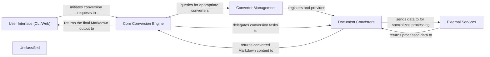

## Details

The `markitdown` project is designed to convert various document and media formats into Markdown. The `User Interface (CLI/Web)` serves as the primary entry point, initiating conversion requests. These requests are handled by the `Core Conversion Engine`, which orchestrates the conversion process. The `Core Conversion Engine` relies on the `Converter Management` component to discover and provide appropriate `Document Converters` for specific file types. `Document Converters` perform the actual parsing and transformation, potentially interacting with `External Services` for advanced processing like document intelligence or audio transcription. Finally, the converted Markdown content is returned through the `Core Conversion Engine` back to the `User Interface`.

### User Interface (CLI/Web)
The primary entry point for users, handling command-line arguments or web API requests, and presenting the final Markdown output.

**Related Classes/Methods**:

### Core Conversion Engine
The central orchestrator that manages the entire conversion workflow, from input identification to delegating tasks and assembling the final output.

**Related Classes/Methods**:

### Converter Management
Manages the registration, discovery, and provision of `DocumentConverter` instances, supporting both built-in and dynamically loaded plugin converters.

**Related Classes/Methods**:

### Document Converters
A collection of specialized modules responsible for parsing and transforming specific document or media formats (e.g., CSV, HTML, Audio, Image, DOCX) into Markdown, including shared conversion utilities.

**Related Classes/Methods**:

### External Services
Represents integrations with third-party cloud services and APIs for advanced functionalities like document intelligence, audio transcription, or image analysis.

**Related Classes/Methods**:

### Unclassified
Component for all unclassified files and utility functions (Utility functions/External Libraries/Dependencies)

**Related Classes/Methods**: _None_

### [FAQ](https://github.com/CodeBoarding/GeneratedOnBoardings/tree/main?tab=readme-ov-file#faq)