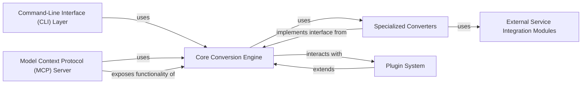

## Details

The `markitdown` architecture is designed as a modular and extensible document processing framework. The `Core Conversion Engine` serves as the central facade, orchestrating the conversion of various document types into markdown. It leverages a diverse set of `Specialized Converters`, each tailored for a specific format and adhering to a common interface. For enhanced capabilities, these converters integrate with `External Service Integration Modules` to utilize third-party services like OCR or LLMs. The system offers multiple interaction points: a `Command-Line Interface (CLI) Layer` for direct user access and a `Model Context Protocol (MCP) Server` that exposes conversion functionalities via a web API, primarily for integration with LLMs. Furthermore, a robust `Plugin System` allows for dynamic extension of the core functionalities with custom converters, ensuring the framework's adaptability and future-proofing.

### Core Conversion Engine
Central orchestrator and facade for all document conversion processes, managing converter registration and dispatch.

**Related Classes/Methods**:

- <a href="https://github.com/microsoft/markitdown/blob/main/packages/markitdown/src/markitdown/_markitdown.py#L1-L1" target="_blank" rel="noopener noreferrer">`markitdown._markitdown` (1:1)</a>
- <a href="https://github.com/microsoft/markitdown/blob/main/packages/markitdown/src/markitdown/_base_converter.py#L1-L1" target="_blank" rel="noopener noreferrer">`markitdown._base_converter` (1:1)</a>

### Specialized Converters
Modules dedicated to converting specific document formats (e.g., PDF, DOCX, HTML) into standardized markdown output.

**Related Classes/Methods**:

- <a href="https://github.com/microsoft/markitdown/blob/main/packages/markitdown/src/markitdown/converters/_pptx_converter.py#L1-L1" target="_blank" rel="noopener noreferrer">`markitdown.converters._pptx_converter` (1:1)</a>
- <a href="https://github.com/microsoft/markitdown/blob/main/packages/markitdown/src/markitdown/converters/_pdf_converter.py#L1-L1" target="_blank" rel="noopener noreferrer">`markitdown.converters._pdf_converter` (1:1)</a>
- <a href="https://github.com/microsoft/markitdown/blob/main/packages/markitdown/src/markitdown/converters/_docx_converter.py#L1-L1" target="_blank" rel="noopener noreferrer">`markitdown.converters._docx_converter` (1:1)</a>

### Command-Line Interface (CLI) Layer
Provides the primary interface for users to interact with the `markitdown` library directly from the terminal.

**Related Classes/Methods**:

- <a href="https://github.com/microsoft/markitdown/blob/main/packages/markitdown/src/markitdown/__main__.py#L1-L1" target="_blank" rel="noopener noreferrer">`markitdown.__main__` (1:1)</a>

### Plugin System
Enables dynamic discovery, loading, and integration of external, custom converters or functionalities, extending the core capabilities.

**Related Classes/Methods**:

- <a href="https://github.com/microsoft/markitdown/blob/main/packages/markitdown-sample-plugin/src/markitdown_sample_plugin/_plugin.py#L1-L1" target="_blank" rel="noopener noreferrer">`markitdown_sample_plugin._plugin` (1:1)</a>

### Model Context Protocol (MCP) Server
A standalone application that exposes the `markitdown` conversion capabilities via a web API, primarily for integration with LLMs and other services.

**Related Classes/Methods**:

- <a href="https://github.com/microsoft/markitdown/blob/main/packages/markitdown-mcp/src/markitdown_mcp/__main__.py#L1-L1" target="_blank" rel="noopener noreferrer">`markitdown_mcp.__main__` (1:1)</a>

### External Service Integration Modules
Facilitates communication and interaction with various third-party services (e.g., Azure Document Intelligence for OCR, LLMs for content description) to enhance the conversion process.

**Related Classes/Methods**:

- <a href="https://github.com/microsoft/markitdown/blob/main/packages/markitdown/src/markitdown/converters/_doc_intel_converter.py#L1-L1" target="_blank" rel="noopener noreferrer">`markitdown.converters._doc_intel_converter` (1:1)</a>
- <a href="https://github.com/microsoft/markitdown/blob/main/packages/markitdown/src/markitdown/converters/_image_converter.py#L1-L1" target="_blank" rel="noopener noreferrer">`markitdown.converters._image_converter` (1:1)</a>
- <a href="https://github.com/microsoft/markitdown/blob/main/packages/markitdown/src/markitdown/converters/_audio_converter.py#L1-L1" target="_blank" rel="noopener noreferrer">`markitdown.converters._audio_converter` (1:1)</a>

### [FAQ](https://github.com/CodeBoarding/GeneratedOnBoardings/tree/main?tab=readme-ov-file#faq)