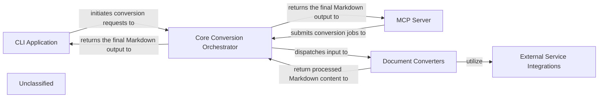

## Details

The `markitdown` project is structured around a central `Core Conversion Orchestrator` that manages the conversion of diverse document formats into Markdown. This orchestrator leverages a modular system of `Document Converters`, each designed for specific file types, and integrates with `External Service Integrations` for advanced processing. User interaction is facilitated through a `CLI Application` for direct command-line usage and an `MCP Server` offering a web-based API. Both interfaces channel conversion requests to the orchestrator, which intelligently dispatches tasks to the relevant converters and returns the final Markdown output.

### CLI Application
The primary command-line interface for users to initiate document conversion.

**Related Classes/Methods**:

- <a href="https://github.com/microsoft/markitdown//blobpackages/markitdown/src/markitdown/__main__.py#L13-L200" target="_blank" rel="noopener noreferrer">`markitdown.__main__.main`:13-200</a>

### MCP Server
The Markitdown Conversion Proxy (MCP) web service, providing an API endpoint for conversion tasks.

**Related Classes/Methods**:

- <a href="https://github.com/microsoft/markitdown//blobpackages/markitdown-mcp/src/markitdown_mcp/__main__.py#L82-L123" target="_blank" rel="noopener noreferrer">`markitdown_mcp.__main__.main`:82-123</a>

### Core Conversion Orchestrator
The central orchestrator of the `markitdown` library. It manages the overall conversion workflow, including converter registration, input parsing, file type identification (via Magika), and dispatching to appropriate document converters. It also handles plugin loading.

**Related Classes/Methods**:

- <a href="https://github.com/microsoft/markitdown//blobpackages/markitdown/src/markitdown/_markitdown.py#L93-L776" target="_blank" rel="noopener noreferrer">`markitdown._markitdown.MarkItDown`:93-776</a>
- <a href="https://github.com/microsoft/markitdown//blobpackages/markitdown/src/markitdown/_markitdown.py" target="_blank" rel="noopener noreferrer">`markitdown._markitdown.MarkItDown.convert`</a>
- <a href="https://github.com/microsoft/markitdown//blobpackages/markitdown/src/markitdown/_markitdown.py" target="_blank" rel="noopener noreferrer">`markitdown._markitdown.MarkItDown.register_converter`</a>
- <a href="https://github.com/microsoft/markitdown//blobpackages/markitdown/src/markitdown/_markitdown.py" target="_blank" rel="noopener noreferrer">`markitdown._markitdown.MarkItDown.enable_plugins`</a>
- <a href="https://github.com/microsoft/markitdown//blobpackages/markitdown/src/markitdown/_markitdown.py" target="_blank" rel="noopener noreferrer">`markitdown._markitdown.MarkItDown._get_stream_info_guesses`</a>

### Document Converters
A family of specialized components, each responsible for converting a specific document format (e.g., HTML, PPTX, PDF, YouTube) into Markdown. They implement `accepts` and `convert` methods and can delegate for nested conversions.

**Related Classes/Methods**:

- <a href="https://github.com/microsoft/markitdown//blobpackages/markitdown/src/markitdown/converters/_html_converter.py#L20-L89" target="_blank" rel="noopener noreferrer">`markitdown.converters._html_converter.HtmlConverter`:20-89</a>
- <a href="https://github.com/microsoft/markitdown//blobpackages/markitdown/src/markitdown/converters/_pptx_converter.py#L34-L264" target="_blank" rel="noopener noreferrer">`markitdown.converters._pptx_converter.PptxConverter`:34-264</a>
- <a href="https://github.com/microsoft/markitdown//blobpackages/markitdown/src/markitdown/converters/_doc_intel_converter.py#L130-L254" target="_blank" rel="noopener noreferrer">`markitdown.converters._doc_intel_converter.DocumentIntelligenceConverter`:130-254</a>
- <a href="https://github.com/microsoft/markitdown//blobpackages/markitdown/src/markitdown/converters/_youtube_converter.py#L37-L238" target="_blank" rel="noopener noreferrer">`markitdown.converters._youtube_converter.YouTubeConverter`:37-238</a>

### External Service Integrations
Components or libraries responsible for communicating with external APIs and services (e.g., Azure Document Intelligence, YouTube API, general HTTP/S endpoints) to fetch or process data required for conversion.

**Related Classes/Methods**:

- <a href="https://github.com/microsoft/markitdown//blobpackages/markitdown/src/markitdown/converters/_doc_intel_converter.py#L130-L254" target="_blank" rel="noopener noreferrer">`markitdown.converters._doc_intel_converter.DocumentIntelligenceConverter`:130-254</a>
- <a href="https://github.com/microsoft/markitdown//blobpackages/markitdown/src/markitdown/converters/_youtube_converter.py#L37-L238" target="_blank" rel="noopener noreferrer">`markitdown.converters._youtube_converter.YouTubeConverter`:37-238</a>

### Unclassified
Component for all unclassified files and utility functions (Utility functions/External Libraries/Dependencies)

**Related Classes/Methods**: _None_

### [FAQ](https://github.com/CodeBoarding/GeneratedOnBoardings/tree/main?tab=readme-ov-file#faq)