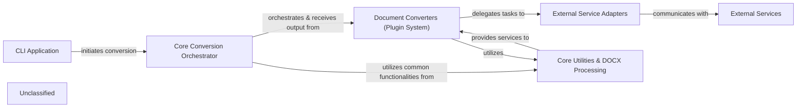

## Details

The `markitdown` project is structured as a modular document conversion system. It features a `CLI Application` as its entry point, which delegates the core conversion workflow to the `Core Conversion Orchestrator`. This orchestrator manages a `Document Converters (Plugin System)`, allowing for flexible handling of various input formats. These converters, in turn, leverage `External Service Adapters` for interactions with third-party APIs and tools, and rely on `Core Utilities & DOCX Processing` for foundational functionalities and specialized document handling. The system interacts with various `External Services` to perform its conversion tasks.

### CLI Application
The command-line interface for `markitdown`, handling user input, configuration, and initiating the document conversion workflow.

**Related Classes/Methods**:

### Core Conversion Orchestrator
The central control unit, responsible for managing the entire conversion pipeline, including discovering and loading pluggable `Document Converters`, coordinating their execution, and handling the overall flow from input to Markdown output.

**Related Classes/Methods**:

### Document Converters (Plugin System)
A collection of specialized, pluggable modules, each designed to transform a specific input document format (e.g., DOCX, PDF, EPUB, HTML, Images, Audio, YouTube) into a standardized Markdown representation. This component embodies the fan-in structure of various conversion capabilities.

**Related Classes/Methods**:

### External Service Adapters
A group of integration components that act as clients for various external services and tools, such as Azure Document Intelligence, Large Language Models (LLMs) for image captioning, ExifTool for metadata extraction, and the YouTube API for data fetching.

**Related Classes/Methods**:

### Core Utilities & DOCX Processing
Provides foundational classes, common utility functions, shared mechanisms (like stream information handling and URI utilities), and specialized modules for pre-processing and handling complex elements within DOCX documents, including MathML to LaTeX conversion.

**Related Classes/Methods**:

### External Services
Represents external third-party services and tools that the `markitdown` application integrates with, such as Azure Document Intelligence, OpenAI (for LLMs), ExifTool CLI, and the YouTube API. These services provide specialized functionalities like document analysis, image captioning, metadata extraction, and data fetching.

**Related Classes/Methods**: _None_

### Unclassified
Component for all unclassified files and utility functions (Utility functions/External Libraries/Dependencies)

**Related Classes/Methods**: _None_

### [FAQ](https://github.com/CodeBoarding/GeneratedOnBoardings/tree/main?tab=readme-ov-file#faq)