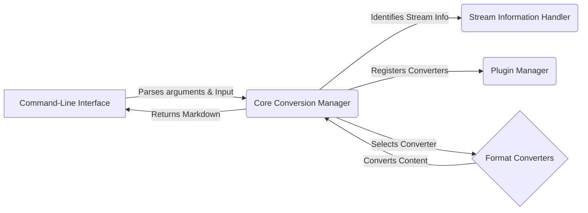

# MarkItDown: High-Level Data Flow Overview

MarkItDown is a versatile tool designed to convert various file formats into Markdown. It supports a wide range of input types, including documents, spreadsheets, presentations, and even audio files, leveraging external tools and plugins to provide comprehensive conversion capabilities.

## Component Descriptions:

**A. Command-Line Interface:** This component serves as the entry point for users, parsing command-line arguments and receiving input files or streams. It then passes control to the Core Conversion Manager to initiate the conversion process and handles the final output, displaying the generated Markdown or writing it to a file. It relates to the Core Conversion Manager by sending the input and receiving the converted markdown.

*   Related files:
    *   `repos.markitdown.packages.markitdown.src.markitdown.__main__.main`: Main function to handle command line arguments and program execution.
    *   `repos.markitdown.packages.markitdown.src.markitdown.__main__._handle_output`: Handles the output of the converted markdown.

**B. Core Conversion Manager:** This component orchestrates the entire conversion process. It receives input from the Command-Line Interface, uses the Stream Information Handler to determine the input type, selects the appropriate converter from the Format Converters, and manages the overall conversion flow. It interacts with the Command-Line Interface by receiving the input and returning the converted markdown, with the Stream Information Handler to identify the stream info, with the Plugin Manager to register converters and with the Format Converters to select the right converter.

*   Related files:
    *   `repos.markitdown.packages.markitdown.src.markitdown._markitdown.MarkItDown`: Core class that manages the conversion process.
    *   `repos.markitdown.packages.markitdown.src.markitdown._markitdown.MarkItDown.convert`: Main conversion method.

**C. Stream Information Handler:** This component analyzes the input stream to determine its type (e.g., MIME type, file extension) and character encoding. It provides this information to the Core Conversion Manager, enabling it to select the appropriate converter. It relates to the Core Conversion Manager by providing information about the input stream.

*   Related files:
    *   `repos.markitdown.packages.markitdown.src.markitdown._stream_info.StreamInfo`: Class to manage stream information.
    *   `repos.markitdown.packages.markitdown.src.markitdown._markitdown.MarkItDown._get_stream_info_guesses`: Guesses the stream information.

**D. Format Converters:** This component houses a collection of specialized converters, each responsible for handling a specific file format (e.g., DOCX, PDF, HTML). These converters extract content from their respective formats and convert it into Markdown. It relates to the Core Conversion Manager by receiving the document to convert and returning the converted content.

*   Related files:
    *   `repos.markitdown.packages.markitdown.src.markitdown.converters._docx_converter.DocxConverter`: Converter for DOCX files.
    *   `repos.markitdown.packages.markitdown.src.markitdown.converters._pdf_converter.PdfConverter`: Converter for PDF files.

**E. Plugin Manager:** This component is responsible for discovering, loading, and registering external plugins. These plugins can provide additional format converters or extend the functionality of the core application. It relates to the Core Conversion Manager by registering the converters.

*   Related files:
    *   `repos.markitdown.packages.markitdown.src.markitdown._markitdown._load_plugins`: Loads the plugins.
    *   `repos.markitdown.packages.markitdown.src.markitdown._markitdown.MarkItDown.enable_plugins`: Enables the plugins.