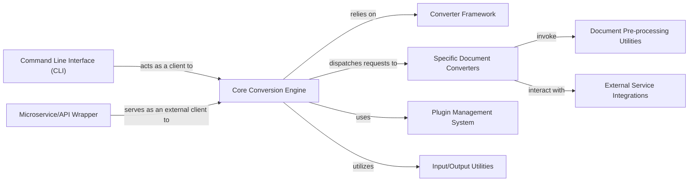

## Details

The `markitdown` project's architecture is centered around the `Core Conversion Engine`, embodied by the `MarkItDown` class, which serves as the primary interface for document conversion. This engine leverages a flexible `Converter Framework` that defines a common `DocumentConverter` interface, allowing for the integration of various `Specific Document Converters` tailored to different file formats. Before conversion, `Document Pre-processing Utilities` can be invoked to prepare complex document elements. The system's extensibility is managed by a `Plugin Management System`, enabling dynamic loading of custom converters. For advanced capabilities, `External Service Integrations` connect to AI/LLM services. `Input/Output Utilities` handle diverse data sources and output management. Users interact with the system via a `Command Line Interface (CLI)`, and the core functionality can also be exposed through an `Microservice/API Wrapper` for broader application integration.

### Core Conversion Engine [[Expand]](./Core_Conversion_Engine.md)
The central orchestrator and facade for all document conversion tasks, managing the lifecycle from input parsing to markdown output.

**Related Classes/Methods**:

- <a href="https://github.com/microsoft/markitdown/blob/main/packages/markitdown/src/markitdown/_markitdown.py#L93-L771" target="_blank" rel="noopener noreferrer">`markitdown._markitdown.MarkItDown`:93-771</a>

### Converter Framework [[Expand]](./Converter_Framework.md)
Defines the foundational structure and standardized interface (`accepts`, `convert`) that all specific document converters must adhere to.

**Related Classes/Methods**:

- <a href="https://github.com/microsoft/markitdown/blob/main/packages/markitdown/src/markitdown/_base_converter.py#L42-L105" target="_blank" rel="noopener noreferrer">`markitdown._base_converter.DocumentConverter`:42-105</a>

### Specific Document Converters [[Expand]](./Specific_Document_Converters.md)
A collection of concrete implementations of the `Converter` interface, specialized in transforming various input document formats (e.g., PPTX, PDF, DOCX, HTML, images, web content) into markdown.

**Related Classes/Methods**:

- <a href="https://github.com/microsoft/markitdown/blob/main/packages/markitdown/src/markitdown/converters/_docx_converter.py#L28-L80" target="_blank" rel="noopener noreferrer">`markitdown.converters._docx_converter.DocxConverter`:28-80</a>

### Document Pre-processing Utilities [[Expand]](./Document_Pre_processing_Utilities.md)
Provides specialized functions to prepare specific document types before their main conversion, including complex tasks like parsing and converting mathematical equations.

**Related Classes/Methods**:

- <a href="https://github.com/microsoft/markitdown/blob/main/packages/markitdown/src/markitdown/converter_utils/docx/pre_process.py" target="_blank" rel="noopener noreferrer">`markitdown.converter_utils.docx.pre_process.pre_process_math`</a>

### Plugin Management System [[Expand]](./Plugin_Management_System.md)
Facilitates the dynamic discovery, loading, and registration of external or custom converters, enabling the project's extensibility.

**Related Classes/Methods**:

- <a href="https://github.com/microsoft/markitdown/blob/main/packages/markitdown/src/markitdown/_markitdown.py#L65-L82" target="_blank" rel="noopener noreferrer">`markitdown._markitdown._load_plugins`:65-82</a>
- <a href="https://github.com/microsoft/markitdown/blob/main/packages/markitdown-sample-plugin/src/markitdown_sample_plugin/_plugin.py" target="_blank" rel="noopener noreferrer">`markitdown_sample_plugin._plugin.SamplePlugin`</a>

### External Service Integrations
Encapsulates the logic for interacting with external AI/LLM services (e.g., Azure Document Intelligence, OpenAI) to enhance conversion capabilities.

**Related Classes/Methods**:

- <a href="https://github.com/microsoft/markitdown/blob/main/packages/markitdown/src/markitdown/converters/_doc_intel_converter.py#L125-L249" target="_blank" rel="noopener noreferrer">`markitdown.converters._doc_intel_converter.DocumentIntelligenceConverter`:125-249</a>

### Input/Output Utilities
A set of helper functions for robustly handling various input sources (local files, URIs, data streams) and managing the output of the conversion process.

**Related Classes/Methods**:

- <a href="https://github.com/microsoft/markitdown/blob/main/packages/markitdown/src/markitdown/_uri_utils.py#L19-L52" target="_blank" rel="noopener noreferrer">`markitdown._uri_utils.parse_data_uri`:19-52</a>

### Command Line Interface (CLI) [[Expand]](./Command_Line_Interface_CLI_.md)
Provides a user-friendly command-line interface for direct interaction with the `markitdown` library, enabling users to perform document conversions from the terminal.

**Related Classes/Methods**:

- <a href="https://github.com/microsoft/markitdown/blob/main/packages/markitdown/src/markitdown/__main__.py#L13-L200" target="_blank" rel="noopener noreferrer">`markitdown.__main__.main`:13-200</a>

### Microservice/API Wrapper [[Expand]](./Microservice_API_Wrapper.md)
An external wrapper that exposes the markitdown capabilities as a web API.

**Related Classes/Methods**: _None_

### [FAQ](https://github.com/CodeBoarding/GeneratedOnBoardings/tree/main?tab=readme-ov-file#faq)