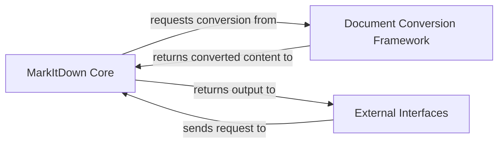

## Details

The `markitdown` project is designed as a modular document processing and conversion library, adhering to patterns like Facade, Strategy, and Plugin Architecture. At its core, it provides a flexible system for converting various document types into markdown, accessible via both a command-line interface and a microservice API.

### MarkItDown Core [[Expand]](./MarkItDown_Core.md)
The central orchestrator and facade of the `markitdown` library. It manages the lifecycle of document conversion, including converter registration, input type detection (utilizing internal stream information management), and dispatching conversion requests to the appropriate handlers. It acts as the primary interface for initiating all conversion operations.

**Related Classes/Methods**:

- <a href="https://github.com/microsoft/markitdown/blob/main/temp/packages/markitdown/src/markitdown/_markitdown.py#L1-L1" target="_blank" rel="noopener noreferrer">`markitdown._markitdown` (1:1)</a>
- <a href="https://github.com/microsoft/markitdown/blob/main/temp/packages/markitdown/src/markitdown/_stream_info.py#L1-L1" target="_blank" rel="noopener noreferrer">`markitdown._stream_info` (1:1)</a>

### Document Conversion Framework [[Expand]](./Document_Conversion_Framework.md)
This component defines the extensible architecture for document conversion. It encompasses the abstract `DocumentConverter` interface, concrete built-in implementations for a wide range of document types (e.g., PDF, DOCX, HTML, Image), and the mechanism for integrating external plugins to extend conversion capabilities. It also includes specialized utilities like the DOCX Math Processor for pre-processing specific content.

**Related Classes/Methods**:

- <a href="https://github.com/microsoft/markitdown/blob/main/temp/packages/markitdown/src/markitdown/_base_converter.py#L1-L1" target="_blank" rel="noopener noreferrer">`markitdown._base_converter` (1:1)</a>
- <a href="https://github.com/microsoft/markitdown/blob/main/temp/packages/markitdown/src/markitdown/converters/_doc_intel_converter.py#L1-L1" target="_blank" rel="noopener noreferrer">`markitdown.converters._doc_intel_converter` (1:1)</a>
- <a href="https://github.com/microsoft/markitdown/blob/main/temp/packages/markitdown/src/markitdown/converters/_epub_converter.py#L1-L1" target="_blank" rel="noopener noreferrer">`markitdown.converters._epub_converter` (1:1)</a>
- <a href="https://github.com/microsoft/markitdown/blob/main/temp/packages/markitdown/src/markitdown/converter_utils/docx/math/omml.py#L1-L1" target="_blank" rel="noopener noreferrer">`markitdown.converter_utils.docx.math.omml` (1:1)</a>
- <a href="https://github.com/microsoft/markitdown/blob/main/temp/packages/markitdown-sample-plugin/src/markitdown_sample_plugin/_plugin.py#L1-L1" target="_blank" rel="noopener noreferrer">`markitdown_sample_plugin._plugin` (1:1)</a>

### External Interfaces [[Expand]](./External_Interfaces.md)
This component provides the various entry points for users and other systems to interact with the `markitdown` library. It includes the Command Line Interface (CLI) for direct user interaction and the Microservice Conversion Platform (MCP) server for remote API-based conversions, allowing `markitdown` to be integrated into larger systems.

**Related Classes/Methods**:

- <a href="https://github.com/microsoft/markitdown/blob/main/temp/packages/markitdown/src/markitdown/__main__.py#L1-L1" target="_blank" rel="noopener noreferrer">`markitdown.__main__` (1:1)</a>
- <a href="https://github.com/microsoft/markitdown/blob/main/temp/packages/markitdown-mcp/src/markitdown_mcp/__main__.py#L1-L1" target="_blank" rel="noopener noreferrer">`markitdown_mcp.__main__` (1:1)</a>

### [FAQ](https://github.com/CodeBoarding/GeneratedOnBoardings/tree/main?tab=readme-ov-file#faq)