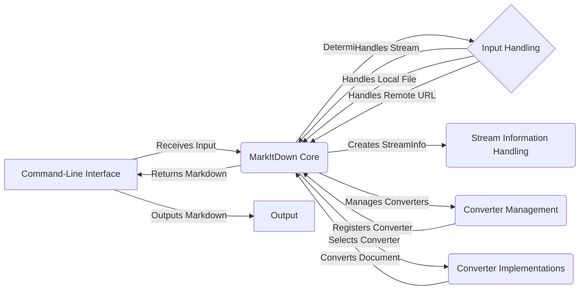

Okay, I'm ready to generate the high-level data flow diagram for the `markitdown` project.

**1. Project Description:**

MarkItDown is a versatile tool designed to convert various document formats and web sources into Markdown. It supports local files, remote URLs, and data streams, offering a unified interface for conversion. The tool is extensible through a converter registration system, allowing users to add support for new file types.

**2. Data Flow Diagram (Mermaid Format):**

**3. Component Descriptions:**

*   **Command-Line Interface:** This is the entry point of the application. It receives user input (file paths, URLs, etc.) and passes it to the `MarkItDown Core` for processing. It also receives the converted Markdown from the `MarkItDown Core` and outputs it to the user.

*   **MarkItDown Core:** This component orchestrates the entire conversion process. It receives input from the `Command-Line Interface`, determines the input type using `Input Handling`, creates `StreamInfo` to store metadata, selects the appropriate converter from `Converter Management`, and then uses `Converter Implementations` to convert the document to Markdown. Finally, it returns the converted Markdown to the `Command-Line Interface`.

*   **Input Handling:** This component handles different types of input such as local files, remote URLs, and data streams. It provides a unified interface for the conversion process to the `MarkItDown Core`.

*   **Stream Information Handling:** This component encapsulates metadata about the input stream, such as MIME type, file extension, and encoding. The `MarkItDown Core` uses this information to select the appropriate converter.

*   **Converter Management:** This component manages the registration and prioritization of converters. The `MarkItDown Core` uses this component to select the appropriate converter for a given input type.

*   **Converter Implementations:** This component provides specific conversion logic for different file types (e.g., HTML, DOCX, PDF) to Markdown. The `MarkItDown Core` uses this component to perform the actual conversion of the document.

*   **Output:** This is the final destination of the converted Markdown, usually the terminal or a file. The `Command-Line Interface` sends the converted Markdown to this component.