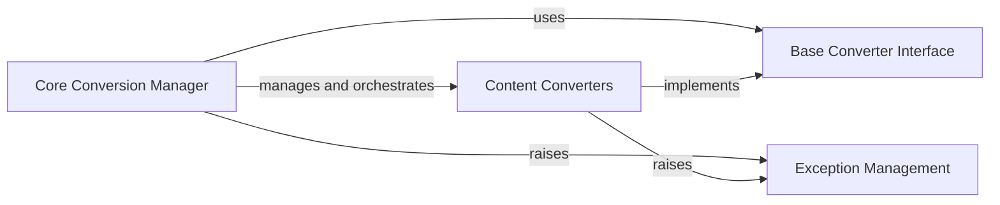

## Component Details

### Core Conversion Manager
The central component responsible for orchestrating the entire conversion process. It handles input from various sources (files, streams, URIs), registers available converters, manages stream information, and normalizes character sets. It acts as the entry point and manages the overall workflow.
- **Related Classes/Methods**: `repos.markitdown.packages.markitdown.src.markitdown._markitdown.MarkItDown`, `repos.markitdown.packages.markitdown.src.markitdown._markitdown.ConverterRegistration`, `repos.markitdown.packages.markitdown.src.markitdown._stream_info.StreamInfo`, `repos.markitdown.packages.markitdown.src.markitdown._uri_utils`

### Base Converter Interface
Defines the abstract base class for all specific converters. It provides a common interface and structure for converters to inherit from, ensuring consistency in how different content types are handled. It also defines the structure of the conversion result, including content and metadata.
- **Related Classes/Methods**: `repos.markitdown.packages.markitdown.src.markitdown._base_converter.DocumentConverterResult`, `repos.markitdown.packages.markitdown.src.markitdown._base_converter`

### Content Converters
A collection of converters designed for various content types, including text-based formats, complex documents, multimedia, web content, and specialized formats. These converters handle the extraction and conversion of content, often leveraging external libraries and APIs for parsing and formatting.
- **Related Classes/Methods**: `repos.markitdown.packages.markitdown.src.markitdown.converters._html_converter.HtmlConverter`, `repos.markitdown.packages.markitdown.src.markitdown.converters._markdownify._CustomMarkdownify`, `repos.markitdown.packages.markitdown.src.markitdown.converters._plain_text_converter.PlainTextConverter`, `repos.markitdown.packages.markitdown.src.markitdown.converters._docx_converter.DocxConverter`, `repos.markitdown.packages.markitdown.src.markitdown.converters._epub_converter.EpubConverter`, `repos.markitdown.packages.markitdown.src.markitdown.converters._pptx_converter.PptxConverter`, `repos.markitdown.packages.markitdown.src.markitdown.converters._xlsx_converter.XlsxConverter`, `repos.markitdown.packages.markitdown.src.markitdown.converters._pdf_converter.PdfConverter`, `repos.markitdown.packages.markitdown.src.markitdown.converters._image_converter.ImageConverter`, `repos.markitdown.packages.markitdown.src.markitdown.converters._audio_converter.AudioConverter`, `repos.markitdown.packages.markitdown.src.markitdown.converters._youtube_converter.YouTubeConverter`, `repos.markitdown.packages.markitdown.src.markitdown.converters._rss_converter.RssConverter`, `repos.markitdown.packages.markitdown.src.markitdown.converters._ipynb_converter.IpynbConverter`, `repos.markitdown.packages.markitdown.src.markitdown.converters._doc_intel_converter.DocumentIntelligenceConverter`

### Exception Management
Defines custom exceptions used within the markitdown library for error handling and reporting.
- **Related Classes/Methods**: `repos.markitdown.packages.markitdown.src.markitdown._exceptions`