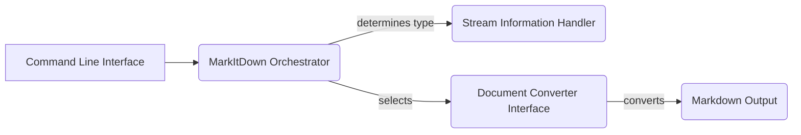

Okay, I will generate an onboarding document for the `markitdown` project based on the provided information.

**Project Description**

MarkItDown is a versatile document conversion tool that transforms various file formats into Markdown. It intelligently selects the appropriate converter based on the input document type, leveraging a modular architecture to support a wide range of formats, including HTML, DOCX, PDF, and more. The tool provides a command-line interface for easy use and can be extended with plugins to support additional formats.

**Flow Diagram**

**Component Descriptions**

*   **MarkItDown Orchestrator:** This central class manages the entire document conversion process. It receives the input document, determines its type using the Stream Information Handler, selects the appropriate Document Converter based on the file type, and orchestrates the conversion process. It also handles the registration of different converters and their priorities.

*   **Document Converter Interface:** This abstract interface defines the contract for all document converters within the system. It ensures that each converter implements a standard `convert` method, allowing the MarkItDown Orchestrator to seamlessly switch between different converters based on the input document type. Concrete implementations handle the specifics of converting various formats like HTML, DOCX, and PDF to Markdown.

*   **HTML Converter Base:** This component provides a base class for converters that handle HTML-like documents. It offers common functionality for parsing and sanitizing HTML content, reducing code duplication among converters for formats like DOCX, EPUB, PPTX, and XLSX, which often contain embedded HTML.

*   **Stream Information Handler:** This component encapsulates information about the input stream, such as the filename, MIME type, and charset. This information is crucial for the MarkItDown Orchestrator to correctly identify the document type and select the appropriate converter.

*   **Command Line Interface:** This component provides a user-friendly interface for interacting with the MarkItDown tool. It handles parsing command-line arguments, invoking the MarkItDown Orchestrator with the specified input file, and displaying the resulting Markdown output.