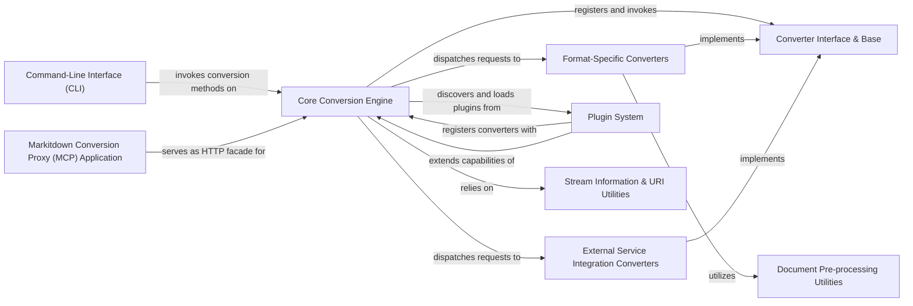

## Details

The `markitdown` project is structured around a `Core Conversion Engine` (`markitdown._markitdown.MarkItDown`) that acts as the central hub for all document conversion operations. This engine is responsible for identifying the input source type (local file, stream, URI, or HTTP response) using `Stream Information & URI Utilities` (`markitdown._stream_info.StreamInfo`, `markitdown._uri_utils.file_uri_to_path`, `markitdown._uri_utils.parse_data_uri`) and then dispatching the conversion task to the appropriate `DocumentConverter` implementation. All converters adhere to the `Converter Interface & Base` (`markitdown._base_converter.DocumentConverter`), ensuring a standardized approach. The system includes `Format-Specific Converters` for common document types (e.g., `PptxConverter`, `DocxConverter`, `PdfConverter`, `HtmlConverter`) and `External Service Integration Converters` that leverage external AI/LLM services (`DocumentIntelligenceConverter`, `LLMCaptionConverter`, `AudioConverter`). Some converters, particularly for DOCX, rely on `Document Pre-processing Utilities` (`pre_process_docx`, `OmmlToLatexConverter`) to prepare the content before conversion. The `Core Conversion Engine` is extensible through a `Plugin System` (`MarkItDown.enable_plugins`, `register_converters`), allowing external modules to register custom converters. Users can interact with the system via a `Command-Line Interface (CLI)` (`markitdown.__main__.main`) or through the `Markitdown Conversion Proxy (MCP) Application` (`markitdown_mcp.__main__.main`), which provides an HTTP API facade for the conversion services.

### Core Conversion Engine [[Expand]](./Core_Conversion_Engine.md)
The central orchestrator responsible for managing the conversion process, registering converters, and providing a unified API for various input types.

**Related Classes/Methods**:

- <a href="https://github.com/microsoft/markitdown/blob/main/packages/markitdown/src/markitdown/_markitdown.py#L92-L770" target="_blank" rel="noopener noreferrer">`markitdown._markitdown.MarkItDown`:92-770)</a>

### Converter Interface & Base [[Expand]](./Converter_Interface_Base.md)
Defines the contract that all document converters must adhere to, ensuring extensibility and interchangeability.

**Related Classes/Methods**:

- <a href="https://github.com/microsoft/markitdown/blob/main/packages/markitdown/src/markitdown/_base_converter.py#L41-L104" target="_blank" rel="noopener noreferrer">`markitdown._base_converter.DocumentConverter`:41-104)</a>

### Format-Specific Converters [[Expand]](./Format_Specific_Converters.md)
A collection of concrete converter implementations for standard document formats.

**Related Classes/Methods**:

- <a href="https://github.com/microsoft/markitdown/blob/main/packages/markitdown/src/markitdown/converters/_pptx_converter.py#L33-L251" target="_blank" rel="noopener noreferrer">`markitdown.converters._pptx_converter.PptxConverter`:33-251)</a>
- <a href="https://github.com/microsoft/markitdown/blob/main/packages/markitdown/src/markitdown/converters/_docx_converter.py#L27-L79" target="_blank" rel="noopener noreferrer">`markitdown.converters._docx_converter.DocxConverter`:27-79)</a>
- <a href="https://github.com/microsoft/markitdown/blob/main/packages/markitdown/src/markitdown/converters/_pdf_converter.py#L30-L76" target="_blank" rel="noopener noreferrer">`markitdown.converters._pdf_converter.PdfConverter`:30-76)</a>
- <a href="https://github.com/microsoft/markitdown/blob/main/packages/markitdown/src/markitdown/converters/_html_converter.py#L19-L89" target="_blank" rel="noopener noreferrer">`markitdown.converters._html_converter.HtmlConverter`:19-89)</a>

### External Service Integration Converters [[Expand]](./External_Service_Integration_Converters.md)
Specialized converters that leverage external AI/LLM services for enhanced conversion capabilities.

**Related Classes/Methods**:

- <a href="https://github.com/microsoft/markitdown/blob/main/packages/markitdown/src/markitdown/converters/_doc_intel_converter.py#L124-L248" target="_blank" rel="noopener noreferrer">`markitdown.converters._doc_intel_converter.DocumentIntelligenceConverter`:124-248)</a>
- <a href="https://github.com/microsoft/markitdown/blob/main/packages/markitdown/src/markitdown/converters/_llm_caption.py#L6-L49" target="_blank" rel="noopener noreferrer">`markitdown.converters._llm_caption.LLMCaptionConverter`:6-49)</a>
- <a href="https://github.com/microsoft/markitdown/blob/main/packages/markitdown/src/markitdown/converters/_audio_converter.py#L22-L100" target="_blank" rel="noopener noreferrer">`markitdown.converters._audio_converter.AudioConverter`:22-100)</a>

### Document Pre-processing Utilities [[Expand]](./Document_Pre_processing_Utilities.md)
Helper functions and modules for preparing specific document types before conversion.

**Related Classes/Methods**:

- <a href="https://github.com/microsoft/markitdown/blob/main/packages/markitdown/src/markitdown/converter_utils/docx/pre_process.py#L117-L155" target="_blank" rel="noopener noreferrer">`markitdown.converter_utils.docx.pre_process.pre_process_docx`:117-155)</a>
- <a href="https://github.com/microsoft/markitdown/blob/main/packages/markitdown/src/markitdown/converter_utils/docx/math/omml.py#L10-L100" target="_blank" rel="noopener noreferrer">`markitdown.converter_utils.docx.math.omml.OmmlToLatexConverter`:10-100)</a>

### Command-Line Interface (CLI)
Provides a user-friendly command-line interface for direct interaction with the Core Conversion Engine.

**Related Classes/Methods**:

- <a href="https://github.com/microsoft/markitdown/blob/main/packages/markitdown/src/markitdown/__main__.py#L12-L199" target="_blank" rel="noopener noreferrer">`markitdown.__main__.main`:12-199)</a>

### Plugin System [[Expand]](./Plugin_System.md)
Facilitates extensibility by allowing external modules to register custom converters.

**Related Classes/Methods**:

- <a href="https://github.com/microsoft/markitdown/blob/main/packages/markitdown/src/markitdown/_markitdown.py#L20-L770" target="_blank" rel="noopener noreferrer">`markitdown._markitdown.MarkItDown.enable_plugins`:20-770)</a>
- <a href="https://github.com/microsoft/markitdown/blob/main/packages/markitdown-sample-plugin/src/markitdown_sample_plugin/_plugin.py#L24-L30" target="_blank" rel="noopener noreferrer">`markitdown_sample_plugin._plugin.register_converters`:24-30)</a>

### Markitdown Conversion Proxy (MCP) Application [[Expand]](./Markitdown_Conversion_Proxy_MCP_Application.md)
A separate web application exposing the conversion capabilities as an HTTP API.

**Related Classes/Methods**:

- <a href="https://github.com/microsoft/markitdown/blob/main/packages/markitdown-mcp/src/markitdown_mcp/__main__.py#L81-L122" target="_blank" rel="noopener noreferrer">`markitdown_mcp.__main__.main`:81-122)</a>

### Stream Information & URI Utilities
Determines input characteristics and is crucial for the Core Conversion Engine to correctly identify and process diverse input sources.

**Related Classes/Methods**:

- <a href="https://github.com/microsoft/markitdown/blob/main/packages/markitdown/src/markitdown/_stream_info.py#L4-L31" target="_blank" rel="noopener noreferrer">`markitdown._stream_info.StreamInfo`:4-31)</a>
- <a href="https://github.com/microsoft/markitdown/blob/main/packages/markitdown/src/markitdown/_uri_utils.py#L7-L15" target="_blank" rel="noopener noreferrer">`markitdown._uri_utils.file_uri_to_path`:7-15)</a>
- <a href="https://github.com/microsoft/markitdown/blob/main/packages/markitdown/src/markitdown/_uri_utils.py#L18-L51" target="_blank" rel="noopener noreferrer">`markitdown._uri_utils.parse_data_uri`:18-51)</a>

### [FAQ](https://github.com/CodeBoarding/GeneratedOnBoardings/tree/main?tab=readme-ov-file#faq)