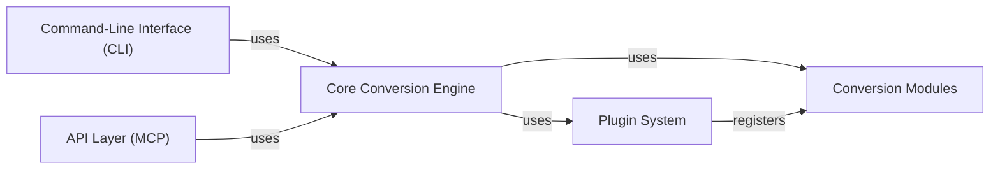

## Details

Abstract Components Overview

### Core Conversion Engine
The central orchestrator (microkernel) responsible for managing the entire document conversion lifecycle. It dispatches conversion requests, handles input/output streams, and integrates with the Plugin System to dynamically load and utilize appropriate Conversion Modules.

**Related Classes/Methods**:

- `markitdown._markitdown.CoreConversionEngine`

### Conversion Modules
A collection of specialized modules, each encapsulating the logic for parsing, content extraction, and transformation of a specific document format (e.g., PDF, DOCX, HTML) into Markdown. These modules adhere to a common interface defined by the system.

**Related Classes/Methods**:

- `markitdown.converters`

### Plugin System
Facilitates the dynamic discovery, loading, and registration of both built-in and third-party plugins. This system extends MarkItDown's capabilities by enabling new document types or custom processing steps, primarily by registering new Conversion Modules.

**Related Classes/Methods**:

- `markitdown._markitdown.PluginSystem`

### Command-Line Interface (CLI)
Provides a command-line interface for users to interact with the MarkItDown conversion engine. It handles argument parsing, input validation, and invokes the Core Conversion Engine.

**Related Classes/Methods**:

- `markitdown.__main__`

### API Layer (MCP)
A separate application built on top of the core MarkItDown library, exposing a programmatic HTTP API for external applications to interact with the conversion capabilities. It handles API requests and orchestrates conversions via the Core Conversion Engine.

**Related Classes/Methods**: _None_

### [FAQ](https://github.com/CodeBoarding/GeneratedOnBoardings/tree/main?tab=readme-ov-file#faq)