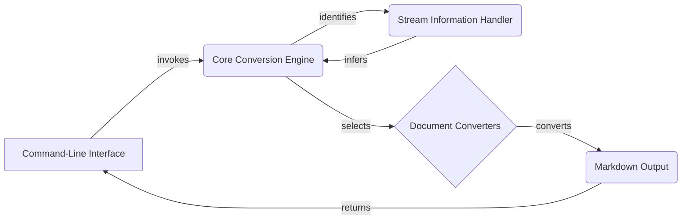

Okay, I'm ready to generate the high-level data flow overview for the `markitdown` project.

**1. Project Description:**

MarkItDown is a versatile document conversion tool that transforms various file formats (e.g., HTML, DOCX, PDF) into Markdown. It provides a command-line interface for users to easily convert documents, leveraging a core conversion engine and specialized converters for each supported format. The tool also handles stream information to correctly process different input types.

**2. Data Flow Diagram (Mermaid Format):**

**3. Component Descriptions:**

*   **Command-Line Interface:** This component serves as the entry point for users. It receives user commands, parses arguments, and triggers the conversion process within the Core Conversion Engine. It also receives the final Markdown output from the Core Conversion Engine and presents it to the user.
*   **Core Conversion Engine:** The central orchestrator of the conversion process. It receives the conversion request from the Command-Line Interface, utilizes the Stream Information Handler to determine the input type, selects the appropriate Document Converter, and manages the overall conversion workflow. It sends document to Document Converters and identifies the stream information with Stream Information Handler.
*   **Stream Information Handler:** This component analyzes the input stream to determine its type (e.g., file extension, MIME type). The inferred information is then used by the Core Conversion Engine to select the correct Document Converter. It infers the stream information and sends it back to Core Conversion Engine.
*   **Document Converters:** This collection of components contains individual converters, each responsible for converting a specific document format into Markdown. The Core Conversion Engine selects the appropriate converter based on the input type identified by the Stream Information Handler. It receives document from Core Conversion Engine and converts it to Markdown Output.
*   **Markdown Output:** The final output of the conversion process, which is a Markdown representation of the input document. It returns the output to Command-Line Interface.