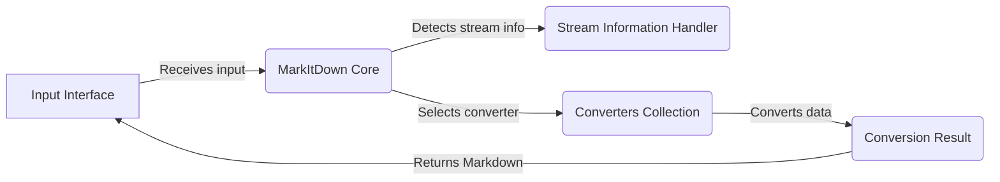

## MarkItDown: High-Level Data Flow Overview

MarkItDown is a versatile tool designed to convert various file formats and data sources into Markdown. It supports local files, remote URIs, and streams, automatically detecting the input type and applying the appropriate conversion logic. The core functionality revolves around managing converters, handling stream information, and orchestrating the conversion process to produce Markdown output.

### Component Descriptions:

**Input Interface:** This component serves as the entry point for the application. It receives input from the command line or other sources, such as file paths or URLs, and passes it to the `MarkItDown Core` for processing. It also receives the final Markdown output from the `Conversion Result` and handles displaying or saving it.

**MarkItDown Core:** This is the central component that orchestrates the entire conversion process. It receives input from the `Input Interface`, uses the `Stream Information Handler` to determine the input type, selects the appropriate converter from the `Converters Collection`, and manages the conversion process. It then receives the converted data from the `Converters Collection` and passes it to the `Conversion Result`.

**Stream Information Handler:** This component analyzes the input stream to determine its type (e.g., file extension, MIME type) and encoding. The `MarkItDown Core` uses this information to select the appropriate converter from the `Converters Collection`. It provides crucial metadata about the input to guide the conversion process.

**Converters Collection:** This component houses a variety of converters, each responsible for handling a specific file format or data source. The `MarkItDown Core` selects the appropriate converter based on the stream information. Each converter then processes the input data and generates a `Conversion Result`.

**Conversion Result:** This component represents the final output of the conversion process. It encapsulates the converted Markdown text and any relevant metadata. The `Input Interface` receives the Markdown output from this component and handles displaying or saving it.