```mermaid
graph LR
    CLI_API_Interface["CLI & API Interface"]
    Core_Conversion_Engine["Core Conversion Engine"]
    Converter_Plugin_System["Converter Plugin System"]
    Document_Converters["Document Converters"]
    Specialized_Conversion_Utilities["Specialized Conversion Utilities"]
    Unclassified["Unclassified"]
    CLI_API_Interface -- "Initiates Conversion Request" --> Core_Conversion_Engine
    Core_Conversion_Engine -- "Loads Plugins" --> Converter_Plugin_System
    Core_Conversion_Engine -- "Dispatches Conversion Task" --> Document_Converters
    Converter_Plugin_System -- "Registers Converters" --> Core_Conversion_Engine
    Document_Converters -- "Utilizes" --> Specialized_Conversion_Utilities
    Specialized_Conversion_Utilities -- "Provides Services To" --> Document_Converters
    click CLI_API_Interface href "https://github.com/CodeBoarding/GeneratedOnBoardings/blob/main/markitdown/CLI_API_Interface.md" "Details"
    click Core_Conversion_Engine href "https://github.com/CodeBoarding/GeneratedOnBoardings/blob/main/markitdown/Core_Conversion_Engine.md" "Details"
    click Converter_Plugin_System href "https://github.com/CodeBoarding/GeneratedOnBoardings/blob/main/markitdown/Converter_Plugin_System.md" "Details"
    click Document_Converters href "https://github.com/CodeBoarding/GeneratedOnBoardings/blob/main/markitdown/Document_Converters.md" "Details"
    click Specialized_Conversion_Utilities href "https://github.com/CodeBoarding/GeneratedOnBoardings/blob/main/markitdown/Specialized_Conversion_Utilities.md" "Details"
```

## Details

The `markitdown` system is designed with a modular architecture, centered around a `Core Conversion Engine` that orchestrates the document conversion process. User interactions are managed by the `CLI & API Interface`, which initiates conversion requests. The system's extensibility is provided by the `Converter Plugin System`, allowing dynamic loading and registration of various `Document Converters`. These converters, specialized for different document formats, often leverage `Specialized Conversion Utilities` for complex or format-specific tasks, ensuring a robust and adaptable conversion pipeline.

### CLI & API Interface [[Expand]](./CLI_API_Interface.md)
The primary user-facing component, handling command-line argument parsing and serving as the entry point for conversion requests.

**Related Classes/Methods**:

- <a href="https://github.com/microsoft/markitdown/blob/main/packages/markitdown/src/markitdown/__main__.py" target="_blank" rel="noopener noreferrer">`packages/markitdown/src/markitdown/__main__.py`</a>

### Core Conversion Engine [[Expand]](./Core_Conversion_Engine.md)
The central orchestrator of the `markitdown` system. It manages the lifecycle of converters, dispatches conversion tasks, and coordinates the overall data flow.

**Related Classes/Methods**:

- <a href="https://github.com/microsoft/markitdown/blob/main/packages/markitdown/src/markitdown/_markitdown.py" target="_blank" rel="noopener noreferrer">`markitdown._markitdown:register_converter`</a>
- <a href="https://github.com/microsoft/markitdown/blob/main/packages/markitdown/src/markitdown/_markitdown.py" target="_blank" rel="noopener noreferrer">`markitdown._markitdown:enable_plugins`</a>
- <a href="https://github.com/microsoft/markitdown/blob/main/packages/markitdown/src/markitdown/_markitdown.py" target="_blank" rel="noopener noreferrer">`markitdown._markitdown:_load_plugins`</a>

### Converter Plugin System [[Expand]](./Converter_Plugin_System.md)
Responsible for dynamically discovering, loading, and registering both internal and external document converters, enabling the system's extensibility.

**Related Classes/Methods**:

- <a href="https://github.com/microsoft/markitdown/blob/main/packages/markitdown/src/markitdown/_markitdown.py" target="_blank" rel="noopener noreferrer">`markitdown._markitdown:register_converter`</a>
- <a href="https://github.com/microsoft/markitdown/blob/main/packages/markitdown/src/markitdown/_markitdown.py" target="_blank" rel="noopener noreferrer">`markitdown._markitdown:enable_plugins`</a>
- <a href="https://github.com/microsoft/markitdown/blob/main/packages/markitdown/src/markitdown/_markitdown.py" target="_blank" rel="noopener noreferrer">`markitdown._markitdown:_load_plugins`</a>

### Document Converters [[Expand]](./Document_Converters.md)
A collection of specialized modules, each acting as an adapter to convert a specific document format (e.g., HTML, PDF, DOCX, YouTube) into a standardized Markdown output.

**Related Classes/Methods**:

- <a href="https://github.com/microsoft/markitdown/blob/main/packages/markitdown/src/markitdown/converters/_html_converter.py" target="_blank" rel="noopener noreferrer">`packages/markitdown/src/markitdown/converters/_html_converter.py`</a>

### Specialized Conversion Utilities [[Expand]](./Specialized_Conversion_Utilities.md)
Provides focused helper functions and modules for complex or format-specific conversion tasks, such as pre-processing DOCX files or translating mathematical expressions.

**Related Classes/Methods**:

- <a href="https://github.com/microsoft/markitdown/blob/main/packages/markitdown/src/markitdown/converter_utils/docx/pre_process.py" target="_blank" rel="noopener noreferrer">`packages/markitdown/src/markitdown/converter_utils/docx/pre_process.py`</a>

### Unclassified
Component for all unclassified files and utility functions (Utility functions/External Libraries/Dependencies)

**Related Classes/Methods**: _None_

### [FAQ](https://github.com/CodeBoarding/GeneratedOnBoardings/tree/main?tab=readme-ov-file#faq)