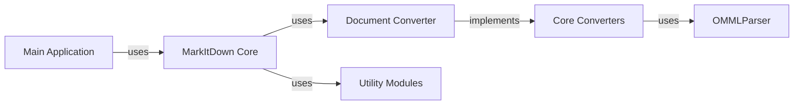

## Component Details

One paragraph explaining the functionality which is represented by this graph. What the main flow is and what is its purpose.

### Main Application
The entry point of the application. Parses command-line arguments, initializes the MarkItDown core, and handles the overall workflow.

**Related Classes/Methods**:

- <a href="https://github.com/microsoft/markitdown/blob/master/packages/markitdown/src/markitdown/__main__.py#L12-L199" target="_blank" rel="noopener noreferrer">`markitdown.__main__.main` (12:199)</a>

### MarkItDown Core
The central orchestrator. Manages the conversion process, initializes converters (built-in and plugins), and handles input/output streams.

**Related Classes/Methods**:

- <a href="https://github.com/microsoft/markitdown/blob/master/packages/markitdown/src/markitdown/_markitdown.py#L92-L770" target="_blank" rel="noopener noreferrer">`markitdown._markitdown.MarkItDown` (92:770)</a>

### Document Converter
Abstract base class defining the interface for all specific document converters (e.g., HTML, DOCX, EPUB).

**Related Classes/Methods**:

- <a href="https://github.com/microsoft/markitdown/blob/master/packages/markitdown/src/markitdown/_base_converter.py#L41-L104" target="_blank" rel="noopener noreferrer">`markitdown._base_converter.DocumentConverter` (41:104)</a>

### Core Converters
A group of concrete converter classes implementing the DocumentConverter interface. Handles the actual conversion logic for different document types.

**Related Classes/Methods**:

- `markitdown.converters.HtmlConverter` (1:150)
- `markitdown.converters.DocxConverter` (1:200)

### Utility Modules
Supporting modules providing reusable functionality.

**Related Classes/Methods**:

- `markitdown.utils.StreamInfo` (1:100)
- `markitdown.utils.OMMLParser` (101:150)
- `markitdown.utils.URIUtils` (251:50)

### [FAQ](https://github.com/CodeBoarding/GeneratedOnBoardings/tree/main?tab=readme-ov-file#faq)