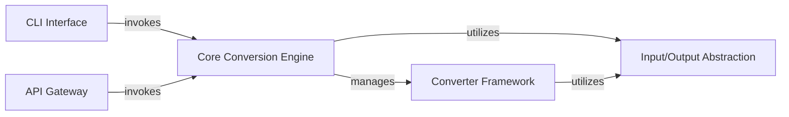

## Details

One paragraph explaining the functionality which is represented by this graph. What the main flow is and what is its purpose.

### Core Conversion Engine [[Expand]](./Core_Conversion_Engine.md)
The central orchestrator responsible for managing the conversion lifecycle, including converter registration, input dispatch, and overall flow control.

**Related Classes/Methods**:

- <a href="https://github.com/microsoft/markitdown/blob/main/packages/markitdown/src/markitdown/_markitdown.py" target="_blank" rel="noopener noreferrer">`markitdown.MarkItDown`</a>
- <a href="https://github.com/microsoft/markitdown/blob/main/packages/markitdown/src/markitdown/__main__.py" target="_blank" rel="noopener noreferrer">`markitdown.__main__.main`</a>

### Converter Framework [[Expand]](./Converter_Framework.md)
Defines the Converter Interface, encompasses Built-in Converters, and integrates the Plugin System for extensible document transformations.

**Related Classes/Methods**:

- <a href="https://github.com/microsoft/markitdown/blob/main/packages/markitdown/src/markitdown/_base_converter.py" target="_blank" rel="noopener noreferrer">`markitdown.DocumentConverter`</a>
- <a href="https://github.com/microsoft/markitdown/blob/main/packages/markitdown/src/markitdown/converters/_plain_text_converter.py" target="_blank" rel="noopener noreferrer">`markitdown.converters.PlainTextConverter`</a>
- <a href="https://github.com/microsoft/markitdown/blob/main/packages/markitdown/src/markitdown/converters/_html_converter.py" target="_blank" rel="noopener noreferrer">`markitdown.converters.HtmlConverter`</a>
- <a href="https://github.com/microsoft/markitdown/blob/main/packages/markitdown/src/markitdown/_markitdown.py" target="_blank" rel="noopener noreferrer">`markitdown.MarkItDown`</a>
- <a href="https://github.com/microsoft/markitdown/blob/main/packages/markitdown-sample-plugin/src/markitdown_sample_plugin/_plugin.py" target="_blank" rel="noopener noreferrer">`markitdown_sample_plugin.register_converters`</a>
- <a href="https://github.com/microsoft/markitdown/blob/main/packages/markitdown-sample-plugin/src/markitdown_sample_plugin/_plugin.py" target="_blank" rel="noopener noreferrer">`markitdown_sample_plugin.RtfConverter`</a>

### Input/Output Abstraction
Provides utilities for handling diverse input sources and standardizes the format of conversion results.

**Related Classes/Methods**:

- <a href="https://github.com/microsoft/markitdown/blob/main/packages/markitdown/src/markitdown/_stream_info.py" target="_blank" rel="noopener noreferrer">`markitdown.StreamInfo`</a>
- <a href="https://github.com/microsoft/markitdown/blob/main/packages/markitdown/src/markitdown/_uri_utils.py" target="_blank" rel="noopener noreferrer">`markitdown._uri_utils.file_uri_to_path`</a>
- <a href="https://github.com/microsoft/markitdown/blob/main/packages/markitdown/src/markitdown/_uri_utils.py" target="_blank" rel="noopener noreferrer">`markitdown._uri_utils.parse_data_uri`</a>

### CLI Interface
The command-line entry point for direct user interaction and conversion initiation.

**Related Classes/Methods**:

- <a href="https://github.com/microsoft/markitdown/blob/main/packages/markitdown/src/markitdown/__main__.py" target="_blank" rel="noopener noreferrer">`markitdown.__main__.main`</a>

### API Gateway
A separate application exposing markitdown's conversion capabilities via a web API.

**Related Classes/Methods**:

- <a href="https://github.com/microsoft/markitdown/blob/main/packages/markitdown-mcp/src/markitdown_mcp/__main__.py" target="_blank" rel="noopener noreferrer">`markitdown_mcp.__main__.main`</a>
- <a href="https://github.com/microsoft/markitdown/blob/main/packages/markitdown-mcp/src/markitdown_mcp/__main__.py" target="_blank" rel="noopener noreferrer">`markitdown_mcp.__main__.convert_to_markdown`</a>

### [FAQ](https://github.com/CodeBoarding/GeneratedOnBoardings/tree/main?tab=readme-ov-file#faq)