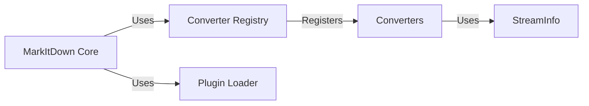

## Component Details

Simplified architecture of markitdown focusing on core components and interactions.  Numerous individual converters are grouped for brevity.

### MarkItDown Core
The central orchestrator. Initializes converters, handles plugin loading, and manages the overall conversion process. This includes the core logic for selecting the appropriate converter based on file type and executing the conversion.

**Related Classes/Methods**:

- <a href="https://github.com/microsoft/markitdown/blob/master/packages/markitdown/src/markitdown/_markitdown.py#L1-L100" target="_blank" rel="noopener noreferrer">`packages/markitdown/src/markitdown/_markitdown.py` (1:100)</a>
- <a href="https://github.com/microsoft/markitdown/blob/master/packages/markitdown/src/markitdown/__main__.py#L1-L50" target="_blank" rel="noopener noreferrer">`packages/markitdown/src/markitdown/__main__.py` (1:50)</a>

### Converter Registry
Manages the registration and lookup of available converters. This component ensures that the MarkItDown core can easily access and utilize different converters without needing explicit knowledge of each one.

**Related Classes/Methods**:

- <a href="https://github.com/microsoft/markitdown/blob/master/packages/markitdown/src/markitdown/_markitdown.py#L101-L150" target="_blank" rel="noopener noreferrer">`packages/markitdown/src/markitdown/_markitdown.py` (101:150)</a>

### Converters
A collection of modules, each responsible for converting a specific file type (e.g., DOCX, HTML, PDF). Each converter implements a common interface (likely defined by an abstract base class).

**Related Classes/Methods**:

- `packages/markitdown/src/markitdown/converters/*` (1:1000)

### StreamInfo
Handles metadata about input streams (files, URLs). Provides a consistent way for converters to access input data regardless of its source.

**Related Classes/Methods**:

- <a href="https://github.com/microsoft/markitdown/blob/master/packages/markitdown/src/markitdown/_stream_info.py#L1-L200" target="_blank" rel="noopener noreferrer">`packages/markitdown/src/markitdown/_stream_info.py` (1:200)</a>

### Plugin Loader
Dynamically loads and registers plugins extending the functionality of markitdown.

**Related Classes/Methods**: _None_

### [FAQ](https://github.com/CodeBoarding/GeneratedOnBoardings/tree/main?tab=readme-ov-file#faq)