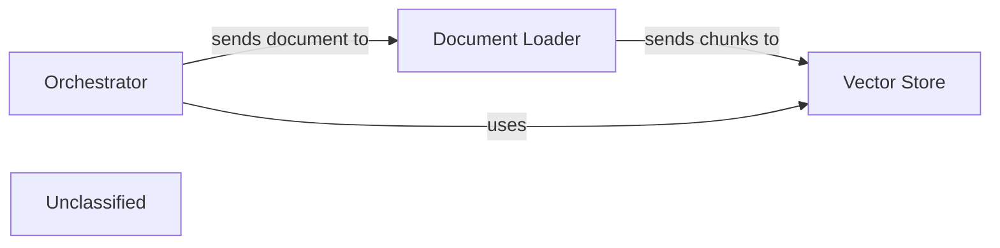

## Details

This graph represents the core functionality of a document processing system. The main flow involves an orchestrator receiving a document, passing it to a document loader, which then loads and splits the document. The processed document chunks are then stored by the vector store. The purpose of this system is to ingest and prepare documents for efficient retrieval and analysis.

### Orchestrator
Manages the overall document processing workflow.

**Related Classes/Methods**:

- `document_processor.Orchestrator`

### Document Loader
Loads and splits documents into manageable chunks.

**Related Classes/Methods**:

- `document_loader.DocumentLoader`
- `document_loader.DocumentLoader:load_document`
- `document_loader.DocumentLoader:split_document`

### Vector Store
Stores and indexes document chunks for efficient retrieval.

**Related Classes/Methods**:

- `vector_store.VectorStore`:1-10
- `vector_store.VectorStore:add_documents`

### Unclassified
Component for all unclassified files and utility functions (Utility functions/External Libraries/Dependencies)

**Related Classes/Methods**: _None_

### [FAQ](https://github.com/CodeBoarding/GeneratedOnBoardings/tree/main?tab=readme-ov-file#faq)