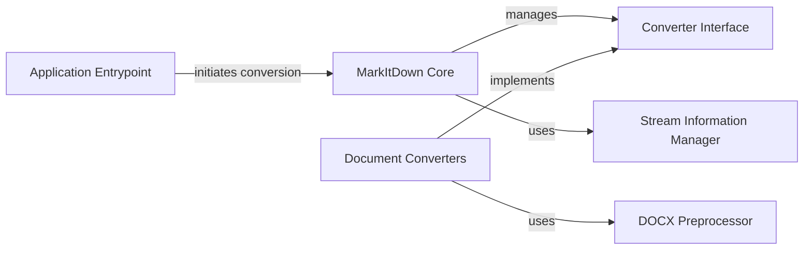

## Component Details

The MarkItDown project facilitates the conversion of various document formats into Markdown. The application begins with the `Application Entrypoint`, which parses command-line arguments and determines the input source. It then leverages the `MarkItDown Core` to manage the conversion process. The core utilizes `Stream Information Manager` to identify the input type and selects the appropriate converter from the `Document Converters`. Each converter implements the `Converter Interface` and may use specialized preprocessors like the `DOCX Preprocessor` to handle format-specific nuances. The final output is a Markdown representation of the original document.

### Application Entrypoint
The entry point of the application, responsible for parsing command-line arguments, determining the input source (file, URL, etc.), and initiating the conversion process by calling the appropriate methods in the MarkItDown Core.
- **Related Classes/Methods**: `markitdown.packages.markitdown.src.markitdown.__main__:main`, `markitdown.packages.markitdown-mcp.src.markitdown_mcp.__main__:main`, `markitdown.packages.markitdown-mcp.src.markitdown_mcp.__main__:convert_to_markdown`

### MarkItDown Core
The central class that manages converters, enables built-in converters and plugins, and orchestrates the conversion process. It determines the appropriate converter based on the input stream's information and provides methods to convert from various sources.
- **Related Classes/Methods**: `markitdown.packages.markitdown.src.markitdown._markitdown.MarkItDown`

### Converter Interface
An abstract base class that defines the interface for all document converters. It specifies the methods that all converters must implement, ensuring a consistent way to convert different document types to Markdown.
- **Related Classes/Methods**: `markitdown.packages.markitdown.src.markitdown._base_converter`

### Stream Information Manager
Manages information about input streams, including filename, extension, MIME type, and URL. This information is crucial for determining the appropriate converter to use.
- **Related Classes/Methods**: `markitdown.packages.markitdown.src.markitdown._stream_info`

### Document Converters
A collection of concrete converter classes, each responsible for converting a specific document format (e.g., DOCX, PDF, HTML) to Markdown. These converters implement the Converter Interface and utilize various libraries and techniques to perform the conversion.
- **Related Classes/Methods**: `markitdown.packages.markitdown.src.markitdown.converters._html_converter`, `markitdown.packages.markitdown.src.markitdown.converters._markdownify`, `markitdown.packages.markitdown.src.markitdown.converters._docx_converter`, `markitdown.packages.markitdown.src.markitdown.converters._pdf_converter`, `markitdown.packages.markitdown.src.markitdown.converters._plain_text_converter`, `markitdown.packages.markitdown.src.markitdown.converters._image_converter`, `markitdown.packages.markitdown.src.markitdown.converters._audio_converter`, `markitdown.packages.markitdown.src.markitdown.converters._rss_converter`, `markitdown.packages.markitdown.src.markitdown.converters._youtube_converter`, `markitdown.packages.markitdown.src.markitdown.converters._doc_intel_converter`

### DOCX Preprocessor
Provides utility functions for pre-processing DOCX files, specifically for converting mathematical equations from OMML to LaTeX format. This ensures that mathematical content is accurately represented in the Markdown output.
- **Related Classes/Methods**: `markitdown.packages.markitdown.src.markitdown.converter_utils.docx.pre_process`, `markitdown.packages.markitdown.src.markitdown.converter_utils.docx.math.omml`