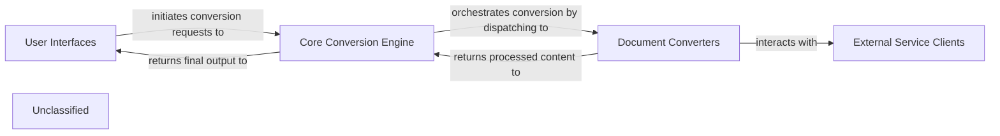

## Details

The `markitdown` project is structured around a core conversion engine that processes various document types into Markdown. User interaction occurs through command-line interfaces or a web API. The system leverages a plugin architecture for extensibility and integrates with external services for advanced processing like transcription and document intelligence. The data flow is primarily unidirectional, starting from user input, moving through the core engine and specialized converters, potentially interacting with external services, and finally returning processed Markdown to the user.

### User Interfaces [[Expand]](./User_Interfaces.md)
Provides the entry points for users to interact with the `markitdown` system, either via command-line or a web API.

**Related Classes/Methods**:

- <a href="https://github.com/microsoft/markitdown/blob/mainpackages/markitdown/src/markitdown/__main__.py" target="_blank" rel="noopener noreferrer">`packages/markitdown/src/markitdown/__main__.py`</a>
- <a href="https://github.com/microsoft/markitdown/blob/mainpackages/markitdown-mcp/src/markitdown_mcp/__main__.py" target="_blank" rel="noopener noreferrer">`packages/markitdown-mcp/src/markitdown_mcp/__main__.py`</a>

### Core Conversion Engine [[Expand]](./Core_Conversion_Engine.md)
The central orchestrator, managing the conversion lifecycle, discovering and loading plugins, inferring input types, and dispatching conversion tasks. It acts as a facade for the conversion process.

**Related Classes/Methods**:

- <a href="https://github.com/microsoft/markitdown/blob/mainpackages/markitdown/src/markitdown/_markitdown.py" target="_blank" rel="noopener noreferrer">`markitdown._markitdown.MarkItDown`</a>
- <a href="https://github.com/microsoft/markitdown/blob/mainpackages/markitdown/src/markitdown/_stream_info.py" target="_blank" rel="noopener noreferrer">`markitdown._stream_info.StreamInfo`</a>

### Document Converters [[Expand]](./Document_Converters.md)
A collection of specialized modules responsible for parsing various document formats, extracting content, pre-processing, and rendering to Markdown. This includes both built-in and plugin-provided converters.

**Related Classes/Methods**:

- <a href="https://github.com/microsoft/markitdown/blob/mainpackages/markitdown/src/markitdown/_base_converter.py" target="_blank" rel="noopener noreferrer">`markitdown._base_converter.BaseConverter`</a>
- <a href="https://github.com/microsoft/markitdown/blob/mainpackages/markitdown/src/markitdown/converters/_html_converter.py" target="_blank" rel="noopener noreferrer">`markitdown.converters._html_converter.HtmlConverter`</a>
- <a href="https://github.com/microsoft/markitdown/blob/mainpackages/markitdown/src/markitdown/converter_utils/docx/pre_process.py" target="_blank" rel="noopener noreferrer">`markitdown.converter_utils.docx.pre_process.DocxPreProcessor`</a>
- <a href="https://github.com/microsoft/markitdown/blob/mainpackages/markitdown/src/markitdown/converters/_markdownify.py" target="_blank" rel="noopener noreferrer">`markitdown.converters._markdownify.MarkdownifyConverter`</a>
- <a href="https://github.com/microsoft/markitdown/blob/mainpackages/markitdown-sample-plugin/src/markitdown_sample_plugin/_plugin.py" target="_blank" rel="noopener noreferrer">`markitdown_sample_plugin._plugin.SamplePlugin`</a>

### External Service Clients [[Expand]](./External_Service_Clients.md)
Handles integration with external AI/ML and data services, abstracting API calls for transcription, document intelligence, video content, and LLM-based processing.

**Related Classes/Methods**:

- <a href="https://github.com/microsoft/markitdown/blob/mainpackages/markitdown/src/markitdown/converters/_transcribe_audio.py" target="_blank" rel="noopener noreferrer">`markitdown.converters._transcribe_audio.AudioConverter`</a>
- <a href="https://github.com/microsoft/markitdown/blob/mainpackages/markitdown/src/markitdown/converters/_youtube_converter.py" target="_blank" rel="noopener noreferrer">`markitdown.converters._youtube_converter.YouTubeConverter`</a>
- <a href="https://github.com/microsoft/markitdown/blob/mainpackages/markitdown/src/markitdown/converters/_doc_intel_converter.py" target="_blank" rel="noopener noreferrer">`markitdown.converters._doc_intel_converter.DocumentIntelligenceConverter`</a>
- <a href="https://github.com/microsoft/markitdown/blob/mainpackages/markitdown/src/markitdown/converters/_llm_caption.py" target="_blank" rel="noopener noreferrer">`markitdown.converters._llm_caption.LLMCaptionConverter`</a>

### Unclassified
Component for all unclassified files and utility functions (Utility functions/External Libraries/Dependencies)

**Related Classes/Methods**: _None_

### [FAQ](https://github.com/CodeBoarding/GeneratedOnBoardings/tree/main?tab=readme-ov-file#faq)