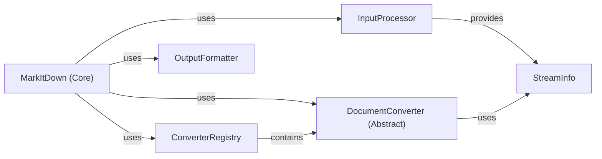

## Component Details

One paragraph explaining the functionality which is represented by this graph. What the main flow is and what is its purpose.

### MarkItDown (Core)
The central orchestrator. Manages the conversion process, including converter registration and plugin execution. It's the main entry point for initiating conversions.

**Related Classes/Methods**: _None_

### ConverterRegistry
A registry that manages the mapping between file types and their corresponding converters. Allows for dynamic addition of converters.

**Related Classes/Methods**: _None_

### DocumentConverter (Abstract)
An abstract base class defining the interface for all specific converters. Each concrete converter (e.g., PdfConverter, HtmlConverter) inherits from this.

**Related Classes/Methods**: _None_

### InputProcessor
Handles the initial processing of input, including file identification, validation, and stream creation. Provides StreamInfo objects to converters.

**Related Classes/Methods**: _None_

### OutputFormatter
Formats the final Markdown output, potentially handling different output styles or options.

**Related Classes/Methods**: _None_

### [FAQ](https://github.com/CodeBoarding/GeneratedOnBoardings/tree/main?tab=readme-ov-file#faq)