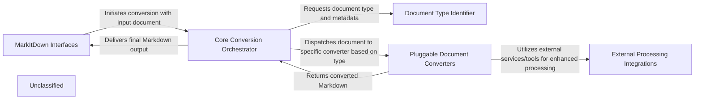

## Details

The MarkItDown architecture is designed for flexible and extensible document-to-Markdown conversion. It operates with a clear separation of concerns, starting with MarkItDown Interfaces that serve as the entry points for conversion requests, whether from a command-line user or an API client. These requests are routed to the Core Conversion Orchestrator, which acts as the central control unit. The Orchestrator first leverages the Document Type Identifier to accurately determine the input document's format. This information then guides the dispatch of the document to the appropriate handler within the Pluggable Document Converters component, which dynamically manages both built-in and external plugin converters. For specialized processing, these converters can interact with External Processing Integrations, utilizing services like Azure Document Intelligence, Large Language Models, or tools like Exiftool. Once converted, the Markdown output flows back through the Orchestrator to the originating interface. This modular design facilitates easy integration of new document types and external AI/ML services, making MarkItDown a versatile tool for diverse document processing needs.

### MarkItDown Interfaces
Provides the primary interaction points for users and external systems to initiate document conversions. This includes the command-line interface (CLI) for direct user interaction and the MarkItDown Conversion Proxy (MCP) server, which exposes a web API for programmatic access.

**Related Classes/Methods**:

- <a href="https://github.com/microsoft/markitdown/blob/main/packages/markitdown/src/markitdown/__main__.py" target="_blank" rel="noopener noreferrer">`markitdown.__main__`</a>
- <a href="https://github.com/microsoft/markitdown/blob/main/packages/markitdown-mcp/src/markitdown_mcp/__main__.py" target="_blank" rel="noopener noreferrer">`markitdown_mcp.__main__`</a>

### Core Conversion Orchestrator
The central brain of MarkItDown, responsible for managing the entire document conversion lifecycle. It receives conversion requests, identifies document types, dispatches tasks to appropriate converters, and handles the overall flow. It also manages the registration of both built-in and plugin converters.

**Related Classes/Methods**:

- <a href="https://github.com/microsoft/markitdown/blob/main/packages/markitdown/src/markitdown/_markitdown.py#L93-L776" target="_blank" rel="noopener noreferrer">`markitdown._markitdown.MarkItDown`:93-776</a>
- <a href="https://github.com/microsoft/markitdown/blob/main/packages/markitdown/src/markitdown/_markitdown.py" target="_blank" rel="noopener noreferrer">`markitdown._markitdown.MarkItDown:convert`</a>
- <a href="https://github.com/microsoft/markitdown/blob/main/packages/markitdown/src/markitdown/_markitdown.py" target="_blank" rel="noopener noreferrer">`markitdown._markitdown.MarkItDown:_convert`</a>
- <a href="https://github.com/microsoft/markitdown/blob/main/packages/markitdown/src/markitdown/_markitdown.py" target="_blank" rel="noopener noreferrer">`markitdown._markitdown.MarkItDown:enable_builtins`</a>
- <a href="https://github.com/microsoft/markitdown/blob/main/packages/markitdown/src/markitdown/_markitdown.py" target="_blank" rel="noopener noreferrer">`markitdown._markitdown.MarkItDown:enable_plugins`</a>
- <a href="https://github.com/microsoft/markitdown/blob/main/packages/markitdown/src/markitdown/_markitdown.py" target="_blank" rel="noopener noreferrer">`markitdown._markitdown.MarkItDown:register_converter`</a>

### Document Type Identifier
A dedicated module that leverages the Magika library to accurately determine the file type, mimetype, and other relevant metadata of input documents. This information is crucial for the Core Conversion Orchestrator to select the correct conversion strategy.

**Related Classes/Methods**:

- <a href="https://github.com/microsoft/markitdown/blob/main/packages/markitdown/src/markitdown/_markitdown.py" target="_blank" rel="noopener noreferrer">`markitdown._markitdown.MarkItDown:_magika`</a>
- <a href="https://github.com/microsoft/markitdown/blob/main/packages/markitdown/src/markitdown/_markitdown.py" target="_blank" rel="noopener noreferrer">`markitdown._markitdown.MarkItDown:_get_stream_info_guesses`</a>

### Pluggable Document Converters
A collection of specialized modules, encompassing both built-in converters and dynamically loaded plugins, each designed to transform a specific document or media type into Markdown. This component embodies the extensibility of MarkItDown, allowing new formats to be supported easily.

**Related Classes/Methods**:

- <a href="https://github.com/microsoft/markitdown/blob/main/packages/markitdown/src/markitdown/converters/" target="_blank" rel="noopener noreferrer">`markitdown.converters`</a>
- <a href="https://github.com/microsoft/markitdown/blob/main/packages/markitdown/src/markitdown/converters/_image_converter.py" target="_blank" rel="noopener noreferrer">`markitdown.converters._image_converter`</a>
- <a href="https://github.com/microsoft/markitdown/blob/main/packages/markitdown/src/markitdown/converters/_html_converter.py" target="_blank" rel="noopener noreferrer">`markitdown.converters._html_converter`</a>
- <a href="https://github.com/microsoft/markitdown/blob/main/packages/markitdown-sample-plugin/src/markitdown_sample_plugin/_plugin.py" target="_blank" rel="noopener noreferrer">`markitdown_sample_plugin._plugin`</a>

### External Processing Integrations
Provides interfaces and adapters for interacting with various external services and utilities that enhance the document conversion process. This includes AI services like Azure Document Intelligence and Large Language Models for content analysis, as well as tools like Exiftool for metadata extraction and specialized utilities for format-specific pre-processing (e.g., DOCX math conversion).

**Related Classes/Methods**:

- <a href="https://github.com/microsoft/markitdown/blob/main/packages/markitdown/src/markitdown/converters/_doc_intel_converter.py" target="_blank" rel="noopener noreferrer">`markitdown.converters._doc_intel_converter`</a>
- <a href="https://github.com/microsoft/markitdown/blob/main/packages/markitdown/src/markitdown/converters/_image_converter.py" target="_blank" rel="noopener noreferrer">`markitdown.converters._image_converter:_get_llm_description`</a>
- <a href="https://github.com/microsoft/markitdown/blob/main/packages/markitdown/src/markitdown/converters/_exiftool.py" target="_blank" rel="noopener noreferrer">`markitdown.converters._exiftool:exiftool_metadata`</a>
- <a href="https://github.com/microsoft/markitdown/blob/main/packages/markitdown/src/markitdown/converter_utils/docx/math/omml.py" target="_blank" rel="noopener noreferrer">`markitdown.converter_utils.docx.math.omml:oMath2Latex`</a>

### Unclassified
Component for all unclassified files and utility functions (Utility functions/External Libraries/Dependencies)

**Related Classes/Methods**: _None_

### [FAQ](https://github.com/CodeBoarding/GeneratedOnBoardings/tree/main?tab=readme-ov-file#faq)