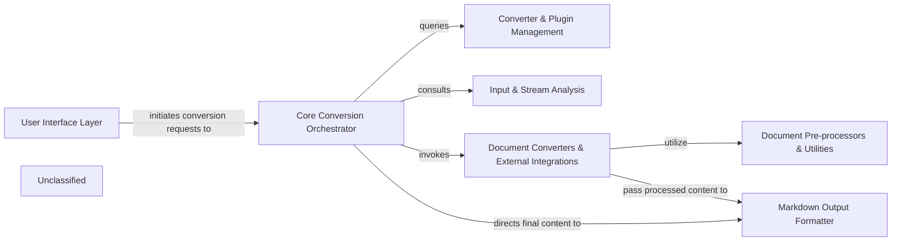

## Details

The Markitdown Document Conversion System is designed to provide a flexible and extensible platform for converting various document formats into standardized Markdown. At its core, the system orchestrates a multi-stage conversion process, from initial input analysis to final Markdown formatting, while supporting dynamic plugin and converter management. This architecture facilitates easy integration of new document types and conversion strategies, making it suitable for diverse document processing needs.

### User Interface Layer [[Expand]](./User_Interface_Layer.md)
Provides the primary interaction points for users, encompassing both the command-line interface and a web API gateway for initiating document conversions.

**Related Classes/Methods**:

- <a href="https://github.com/microsoft/markitdown/blob/main/packages/markitdown/src/markitdown/__main__.py" target="_blank" rel="noopener noreferrer">`markitdown.__main__`</a>
- <a href="https://github.com/microsoft/markitdown/blob/main/packages/markitdown-mcp/src/markitdown_mcp/__main__.py" target="_blank" rel="noopener noreferrer">`markitdown_mcp.__main__`</a>

### Core Conversion Orchestrator [[Expand]](./Core_Conversion_Orchestrator.md)
The central brain of the system, managing the entire conversion pipeline. It determines the conversion strategy, invokes appropriate converters, and applies plugins based on input analysis.

**Related Classes/Methods**:

- <a href="https://github.com/microsoft/markitdown/blob/main/packages/markitdown/src/markitdown/_markitdown.py#L93-L776" target="_blank" rel="noopener noreferrer">`markitdown._markitdown.MarkItDown`:93-776</a>

### Converter & Plugin Management [[Expand]](./Converter_Plugin_Management.md)
Manages the lifecycle of document converters and plugins, including registration, discovery, and dynamic loading. It ensures the system is extensible and adaptable to new formats.

**Related Classes/Methods**:

- <a href="https://github.com/microsoft/markitdown/blob/main/packages/markitdown/src/markitdown/_markitdown.py" target="_blank" rel="noopener noreferrer">`markitdown._markitdown.MarkItDown.enable_plugins`</a>
- <a href="https://github.com/microsoft/markitdown/blob/main/packages/markitdown/src/markitdown/_markitdown.py" target="_blank" rel="noopener noreferrer">`markitdown._markitdown.MarkItDown.register_converter`</a>
- <a href="https://github.com/microsoft/markitdown/blob/main/packages/markitdown/src/markitdown/_base_converter.py#L42-L105" target="_blank" rel="noopener noreferrer">`markitdown._base_converter.DocumentConverter`:42-105</a>

### Input & Stream Analysis [[Expand]](./Input_Stream_Analysis.md)
Analyzes the incoming document stream to identify its type, extract initial metadata, and provide hints for selecting the correct converter.

**Related Classes/Methods**:

- <a href="https://github.com/microsoft/markitdown/blob/main/packages/markitdown/src/markitdown/_stream_info.py" target="_blank" rel="noopener noreferrer">`markitdown._stream_info`</a>
- <a href="https://github.com/microsoft/markitdown/blob/main/packages/markitdown/src/markitdown/_markitdown.py" target="_blank" rel="noopener noreferrer">`markitdown._markitdown.MarkItDown._get_stream_info_guesses`</a>

### Document Converters & External Integrations [[Expand]](./Document_Converters_External_Integrations.md)
A collection of specialized modules, each designed to convert a specific document format (e.g., PDF, DOCX, Images, Audio) into an intermediate representation or directly into Markdown. This component also handles interactions with external services like Azure Document Intelligence and LLMs.

**Related Classes/Methods**:

- <a href="https://github.com/microsoft/markitdown/blob/main/packages/markitdown/src/markitdown/converters/_csv_converter.py#L38-L77" target="_blank" rel="noopener noreferrer">`markitdown.converters._csv_converter.convert`:38-77</a>
- <a href="https://github.com/microsoft/markitdown/blob/main/packages/markitdown/src/markitdown/converters/_image_converter.py#L39-L85" target="_blank" rel="noopener noreferrer">`markitdown.converters._image_converter.convert`:39-85</a>
- <a href="https://github.com/microsoft/markitdown/blob/main/packages/markitdown/src/markitdown/converters/_doc_intel_converter.py#L237-L254" target="_blank" rel="noopener noreferrer">`markitdown.converters._doc_intel_converter.convert`:237-254</a>
- <a href="https://github.com/microsoft/markitdown/blob/main/packages/markitdown-sample-plugin/src/markitdown_sample_plugin/_plugin.py#L57-L71" target="_blank" rel="noopener noreferrer">`markitdown_sample_plugin._plugin.convert`:57-71</a>

### Document Pre-processors & Utilities [[Expand]](./Document_Pre_processors_Utilities.md)
Provides helper functions and pre-processing steps for specific document formats, ensuring content is in a suitable state for conversion (e.g., handling DOCX mathematical equations).

**Related Classes/Methods**:

- <a href="https://github.com/microsoft/markitdown/blob/main/packages/markitdown/src/markitdown/converter_utils/docx/pre_process.py" target="_blank" rel="noopener noreferrer">`markitdown.converter_utils.docx.pre_process`</a>
- <a href="https://github.com/microsoft/markitdown/blob/main/packages/markitdown/src/markitdown/converter_utils/docx/math/omml.py" target="_blank" rel="noopener noreferrer">`markitdown.converter_utils.docx.math.omml`</a>

### Markdown Output Formatter [[Expand]](./Markdown_Output_Formatter.md)
Takes the processed content (often in an intermediate format like HTML) and transforms it into a clean, standardized Markdown output, handling formatting and syntax.

**Related Classes/Methods**:

- <a href="https://github.com/microsoft/markitdown/blob/main/packages/markitdown/src/markitdown/converters/_markdownify.py#L8-L126" target="_blank" rel="noopener noreferrer">`markitdown.converters._markdownify._CustomMarkdownify`:8-126</a>

### Unclassified
Component for all unclassified files and utility functions (Utility functions/External Libraries/Dependencies)

**Related Classes/Methods**: _None_

### [FAQ](https://github.com/CodeBoarding/GeneratedOnBoardings/tree/main?tab=readme-ov-file#faq)