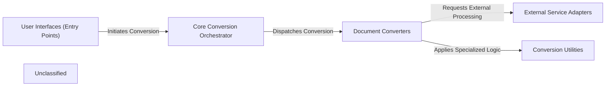

## Details

The `markitdown` project is designed for converting various document formats into Markdown. The system's entry points, handled by the User Interfaces (Entry Points) component, allow users to initiate conversions either through a command-line interface or via an MCP server. These entry points interact with the Core Conversion Orchestrator, which is the central component responsible for managing the conversion process. The orchestrator identifies the input document type and dispatches the conversion task to the appropriate module within the Document Converters component. Each document converter is specialized for a specific format (e.g., PDF, DOCX, HTML, Image). For advanced parsing or content generation, Document Converters may interact with External Service Adapters, which abstract interactions with services like Azure Document Intelligence or Large Language Models. Additionally, Document Converters leverage Conversion Utilities for specialized tasks such as pre-processing DOCX files or converting mathematical expressions to LaTeX. This modular design ensures extensibility and maintainability, allowing for easy integration of new document formats or external services.

### User Interfaces (Entry Points)
Provides the primary means for users or other applications to interact with the `markitdown` conversion capabilities. This includes both command-line interface (CLI) and a Micro-service Control Plane (MCP) server for HTTP/SSE interactions.

**Related Classes/Methods**:

- <a href="https://github.com/microsoft/markitdown/blob/mainpackages/markitdown/src/markitdown/__main__.py#L13-L200" target="_blank" rel="noopener noreferrer">`markitdown.__main__.main`:13-200</a>
- <a href="https://github.com/microsoft/markitdown/blob/mainpackages/markitdown-mcp/src/markitdown_mcp/__main__.py#L82-L123" target="_blank" rel="noopener noreferrer">`markitdown_mcp.__main__.main`:82-123</a>

### Core Conversion Orchestrator
The central brain of `markitdown`, responsible for managing the conversion workflow, identifying document types, and dispatching tasks to appropriate converters. It also handles the registration and enablement of plugins.

**Related Classes/Methods**:

- <a href="https://github.com/microsoft/markitdown/blob/mainpackages/markitdown/src/markitdown/_markitdown.py#L93-L776" target="_blank" rel="noopener noreferrer">`markitdown._markitdown.MarkItDown`:93-776</a>

### Document Converters
A modular collection of specialized components, each designed to transform a specific input document format (e.g., PDF, DOCX, Image, HTML) into a standardized Markdown output.

**Related Classes/Methods**:

- <a href="https://github.com/microsoft/markitdown/blob/mainpackages/markitdown/src/markitdown/converters/_image_converter.py#L39-L85" target="_blank" rel="noopener noreferrer">`markitdown.converters._image_converter.ImageConverter.convert`:39-85</a>
- <a href="https://github.com/microsoft/markitdown/blob/mainpackages/markitdown/src/markitdown/converters/_doc_intel_converter.py#L237-L254" target="_blank" rel="noopener noreferrer">`markitdown.converters._doc_intel_converter.DocumentIntelligenceConverter.convert`:237-254</a>
- <a href="https://github.com/microsoft/markitdown/blob/mainpackages/markitdown/src/markitdown/converters/_plain_text_converter.py" target="_blank" rel="noopener noreferrer">`markitdown.converters._plain_text_converter.PlainTextConverter`</a>
- <a href="https://github.com/microsoft/markitdown/blob/mainpackages/markitdown/src/markitdown/converters/_html_converter.py" target="_blank" rel="noopener noreferrer">`markitdown.converters._html_converter.HtmlConverter`</a>
- <a href="https://github.com/microsoft/markitdown/blob/mainpackages/markitdown/src/markitdown/converters/_pdf_converter.py" target="_blank" rel="noopener noreferrer">`markitdown.converters._pdf_converter.PdfConverter`</a>
- <a href="https://github.com/microsoft/markitdown/blob/mainpackages/markitdown/src/markitdown/converters/_docx_converter.py" target="_blank" rel="noopener noreferrer">`markitdown.converters._docx_converter.DocxConverter`</a>

### External Service Adapters
Manages interactions with external APIs and services, such as Azure Document Intelligence for advanced document parsing, and Large Language Models (LLMs) for enhanced content processing. This component also handles HTTP requests.

**Related Classes/Methods**:

- <a href="https://github.com/microsoft/markitdown/blob/mainpackages/markitdown/src/markitdown/converters/_doc_intel_converter.py" target="_blank" rel="noopener noreferrer">`markitdown.converters._doc_intel_converter.DocumentIntelligenceClient`</a>
- <a href="https://github.com/microsoft/markitdown/blob/mainpackages/markitdown/src/markitdown/_markitdown.py" target="_blank" rel="noopener noreferrer">`requests.Session`</a>
- <a href="https://github.com/microsoft/markitdown/blob/mainpackages/markitdown/src/markitdown/converters/_image_converter.py" target="_blank" rel="noopener noreferrer">`openai.OpenAI`</a>

### Conversion Utilities
Provides specialized helper functions and modules used by Document Converters for complex tasks, such as pre-processing DOCX content or converting mathematical markup.

**Related Classes/Methods**:

- <a href="https://github.com/microsoft/markitdown/blob/mainpackages/markitdown/src/markitdown/converter_utils/docx/pre_process.py#L118-L156" target="_blank" rel="noopener noreferrer">`markitdown.converter_utils.docx.pre_process.pre_process_docx`:118-156</a>
- <a href="https://github.com/microsoft/markitdown/blob/mainpackages/markitdown/src/markitdown/converter_utils/docx/math/omml.py#L170-L400" target="_blank" rel="noopener noreferrer">`markitdown.converter_utils.docx.math.omml.oMath2Latex`:170-400</a>

### Unclassified
Component for all unclassified files and utility functions (Utility functions/External Libraries/Dependencies)

**Related Classes/Methods**: _None_

### [FAQ](https://github.com/CodeBoarding/GeneratedOnBoardings/tree/main?tab=readme-ov-file#faq)