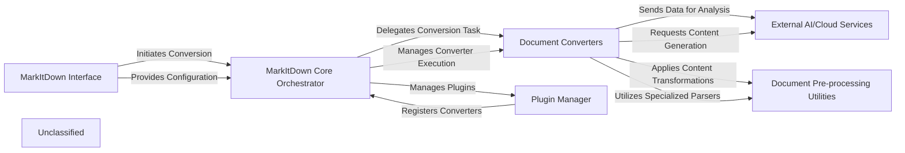

## Details

The MarkItDown system is structured around a core orchestrator that manages document conversion workflows. User interaction, whether via CLI or API, is handled by the `MarkItDown Interface`, which then delegates conversion tasks to the `MarkItDown Core Orchestrator`. This orchestrator is responsible for selecting and managing various `Document Converters`, which are specialized modules for different document formats. To extend its capabilities, the orchestrator interacts with a `Plugin Manager` that handles the loading and registration of external converters. During the conversion process, `Document Converters` can leverage `Document Pre-processing Utilities` for specific content transformations and integrate with `External AI/Cloud Services` for advanced analysis or content generation, ensuring a flexible and extensible document conversion pipeline.

### MarkItDown Interface
Provides the primary user interaction points, including the command-line interface and the Python API for initiating and configuring document conversions.

**Related Classes/Methods**: _None_

### MarkItDown Core Orchestrator
The central control module responsible for managing the overall conversion workflow, selecting appropriate converters, and orchestrating the conversion process.

**Related Classes/Methods**: _None_

### Document Converters
A collection of specialized modules, each designed to convert a specific document format (e.g., CSV, HTML, DOCX) into Markdown. These are the workhorses of the conversion process.

**Related Classes/Methods**: _None_

### Plugin Manager
Manages the discovery, loading, and registration of external converter plugins, allowing for easy extension of MarkItDown's capabilities without modifying the core.

**Related Classes/Methods**: _None_

### External AI/Cloud Services
Adapters and integrations for external services such as Azure Document Intelligence for advanced document parsing and Large Language Models (LLMs) for tasks like image captioning or audio transcription.

**Related Classes/Methods**: _None_

### Document Pre-processing Utilities
Specialized utility modules used by converters to perform pre-processing and transformation tasks on specific document types, such as converting mathematical equations in DOCX files to LaTeX.

**Related Classes/Methods**: _None_

### Unclassified
Component for all unclassified files and utility functions (Utility functions/External Libraries/Dependencies)

**Related Classes/Methods**: _None_

### [FAQ](https://github.com/CodeBoarding/GeneratedOnBoardings/tree/main?tab=readme-ov-file#faq)