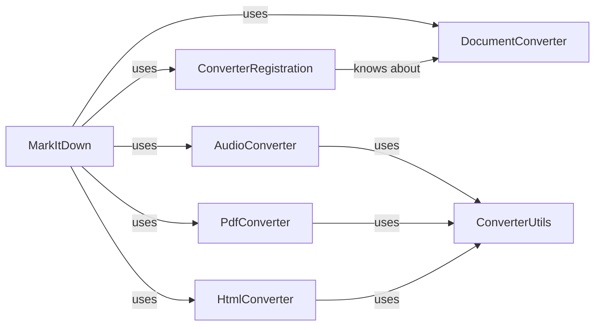

## Component Details

MarkItDown component architecture overview

### MarkItDown
The main component orchestrating the document conversion process. Registers converters, manages input streams, and delegates conversion tasks.

**Related Classes/Methods**:

- <a href="https://github.com/microsoft/markitdown/blob/master/packages/markitdown/src/markitdown/_markitdown.py#L92-L770" target="_blank" rel="noopener noreferrer">`packages.markitdown.src.markitdown._markitdown.MarkItDown` (92:770)</a>

### ConverterRegistration
Manages the registration of available converters, enabling MarkItDown to dynamically select the appropriate converter based on the input file type. Acts as an intermediary between MarkItDown and the converters.

**Related Classes/Methods**:

- <a href="https://github.com/microsoft/markitdown/blob/master/packages/markitdown/src/markitdown/_markitdown.py#L85-L89" target="_blank" rel="noopener noreferrer">`packages.markitdown.src.markitdown._markitdown.ConverterRegistration` (85:89)</a>

### DocumentConverter
Abstract base class defining the interface for all specific file converters. Individual converters inherit from this class, ensuring a consistent conversion process.

**Related Classes/Methods**:

- <a href="https://github.com/microsoft/markitdown/blob/master/packages/markitdown/src/markitdown/_base_converter.py#L41-L104" target="_blank" rel="noopener noreferrer">`packages.markitdown.src.markitdown._base_converter.DocumentConverter` (41:104)</a>

### AudioConverter
Concrete converter classes, each responsible for converting a specific file type. These classes implement the DocumentConverter interface.

**Related Classes/Methods**:

- `packages.markitdown.src.markitdown.converters.AudioConverter` (1:50)

### PdfConverter
Concrete converter classes, each responsible for converting a specific file type. These classes implement the DocumentConverter interface.

**Related Classes/Methods**:

- `packages.markitdown.src.markitdown.converters.PdfConverter` (1:50)

### HtmlConverter
Concrete converter classes, each responsible for converting a specific file type. These classes implement the DocumentConverter interface.

**Related Classes/Methods**:

- `packages.markitdown.src.markitdown.converters.HtmlConverter` (1:50)

### ConverterUtils
Contains reusable utility functions used by multiple file converters to perform common tasks (e.g., file I/O, data manipulation).

**Related Classes/Methods**:

- `packages.markitdown.src.markitdown.converter_utils.*` (1:100)

### [FAQ](https://github.com/CodeBoarding/GeneratedOnBoardings/tree/main?tab=readme-ov-file#faq)