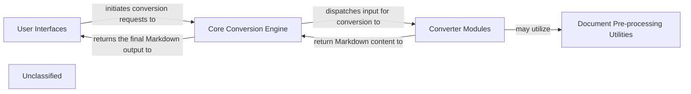

## Details

The Markitdown project is structured around a modular conversion engine, enabling flexible document-to-markdown transformations. User interactions, whether via command-line or API, are handled by the `User Interfaces` component, which initiates conversion requests. The `Core Conversion Engine` acts as the central orchestrator, managing a diverse set of `Converter Modules` responsible for specific file types and external service integrations. Before conversion, complex documents may pass through `Document Pre-processing Utilities` to standardize content. This design promotes extensibility, allowing new converters and pre-processing steps to be integrated seamlessly, and ensures a clear data flow from input to Markdown output.

### User Interfaces [[Expand]](./User_Interfaces.md)
Provides the primary interaction points for users and external applications. It encompasses both the command-line interface and a dedicated API server for conversion requests.

**Related Classes/Methods**:

- <a href="https://github.com/microsoft/markitdown/blob/mainpackages/markitdown/src/markitdown/__main__.py#L13-L200" target="_blank" rel="noopener noreferrer">`markitdown.__main__.main`:13-200</a>
- <a href="https://github.com/microsoft/markitdown/blob/mainpackages/markitdown-mcp/src/markitdown_mcp/__main__.py#L82-L123" target="_blank" rel="noopener noreferrer">`markitdown_mcp.__main__.main`:82-123</a>

### Core Conversion Engine [[Expand]](./Core_Conversion_Engine.md)
The central orchestrator of Markitdown. It manages available converters, dispatches conversion requests, and handles the dynamic loading and registration of plugin converters, ensuring extensibility.

**Related Classes/Methods**:

- <a href="https://github.com/microsoft/markitdown/blob/mainpackages/markitdown/src/markitdown/_markitdown.py#L93-L776" target="_blank" rel="noopener noreferrer">`markitdown._markitdown.MarkItDown`:93-776</a>
- <a href="https://github.com/microsoft/markitdown/blob/mainpackages/markitdown/src/markitdown/_markitdown.py" target="_blank" rel="noopener noreferrer">`markitdown._markitdown.MarkItDown.convert`</a>
- <a href="https://github.com/microsoft/markitdown/blob/mainpackages/markitdown/src/markitdown/_markitdown.py" target="_blank" rel="noopener noreferrer">`markitdown._markitdown.MarkItDown.register_converter`</a>
- <a href="https://github.com/microsoft/markitdown/blob/mainpackages/markitdown/src/markitdown/_markitdown.py#L65-L82" target="_blank" rel="noopener noreferrer">`markitdown._markitdown._load_plugins`:65-82</a>

### Converter Modules [[Expand]](./Converter_Modules.md)
A collection of specialized modules responsible for converting various document and data formats into Markdown. This includes both built-in input adapters (e.g., CSV, DOCX, PDF) and clients for external services (e.g., Azure Document Intelligence, audio transcription, YouTube).

**Related Classes/Methods**:

- <a href="https://github.com/microsoft/markitdown/blob/mainpackages/markitdown/src/markitdown/converters/_csv_converter.py" target="_blank" rel="noopener noreferrer">`markitdown.converters.CsvConverter`</a>
- <a href="https://github.com/microsoft/markitdown/blob/mainpackages/markitdown/src/markitdown/converters/_docx_converter.py" target="_blank" rel="noopener noreferrer">`markitdown.converters.DocxConverter`</a>
- <a href="https://github.com/microsoft/markitdown/blob/mainpackages/markitdown/src/markitdown/converters/_pdf_converter.py" target="_blank" rel="noopener noreferrer">`markitdown.converters.PdfConverter`</a>
- <a href="https://github.com/microsoft/markitdown/blob/mainpackages/markitdown/src/markitdown/converters/_doc_intel_converter.py" target="_blank" rel="noopener noreferrer">`markitdown.converters.DocumentIntelligenceConverter`</a>
- <a href="https://github.com/microsoft/markitdown/blob/mainpackages/markitdown/src/markitdown/converters/_transcribe_audio.py" target="_blank" rel="noopener noreferrer">`markitdown.converters.AudioConverter`</a>
- <a href="https://github.com/microsoft/markitdown/blob/mainpackages/markitdown/src/markitdown/converters/_youtube_converter.py" target="_blank" rel="noopener noreferrer">`markitdown.converters.YouTubeConverter`</a>

### Document Pre-processing Utilities [[Expand]](./Document_Pre_processing_Utilities.md)
Helper modules that prepare complex document formats before the main conversion process. This includes tasks such as converting mathematical equations from OMML to LaTeX within DOCX files.

**Related Classes/Methods**:

- <a href="https://github.com/microsoft/markitdown/blob/mainpackages/markitdown/src/markitdown/converter_utils/docx/pre_process.py#L118-L156" target="_blank" rel="noopener noreferrer">`markitdown.converter_utils.docx.pre_process.pre_process_docx`:118-156</a>
- <a href="https://github.com/microsoft/markitdown/blob/mainpackages/markitdown/src/markitdown/converter_utils/docx/math/omml.py#L153-L383" target="_blank" rel="noopener noreferrer">`markitdown.converter_utils.docx.math.omml.oMath2Latex`:153-383</a>

### Unclassified
Component for all unclassified files and utility functions (Utility functions/External Libraries/Dependencies)

**Related Classes/Methods**: _None_

### [FAQ](https://github.com/CodeBoarding/GeneratedOnBoardings/tree/main?tab=readme-ov-file#faq)