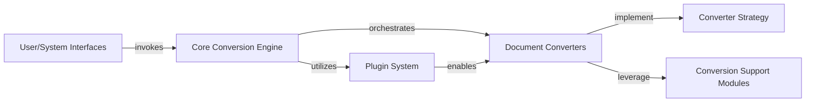

## Details

The `markitdown` architecture is designed for modularity and extensibility, with the `Core Conversion Engine` serving as the central facade. This engine dispatches conversion requests to various `Document Converters`, which are dynamically managed by the `Plugin System` and adhere to a common `Converter Strategy`. These converters are further supported by `Conversion Support Modules` for specialized preprocessing and integration with external services. Both the `Command-Line Interface` and the `Model Context Protocol (MCP) Server` act as `User/System Interfaces`, providing distinct entry points for interacting with the core conversion capabilities. This design allows for easy addition of new document types and external service integrations without altering the core logic, making `markitdown` a flexible and powerful data preprocessing tool for various document formats.

### Core Conversion Engine
The central orchestrator and simplified interface for all document conversion operations. It manages the registry of available converters and dispatches conversion requests.

**Related Classes/Methods**:

- <a href="https://github.com/microsoft/markitdown/blob/main/packages/markitdown/src/markitdown/_markitdown.py#L-1-L-1" target="_blank" rel="noopener noreferrer">`packages.markitdown.src.markitdown._markitdown` (-1:-1)</a>

### Converter Strategy
Defines the standard contract (`accepts`, `convert`) that all specialized document converters must adhere to, enabling a pluggable architecture.

**Related Classes/Methods**:

- <a href="https://github.com/microsoft/markitdown/blob/main/packages/markitdown/src/markitdown/_base_converter.py#L-1-L-1" target="_blank" rel="noopener noreferrer">`packages.markitdown.src.markitdown._base_converter` (-1:-1)</a>

### Document Converters
A collection of concrete implementations of the `Converter Strategy`, each designed to convert a specific document format into standardized Markdown.

**Related Classes/Methods**:

- <a href="https://github.com/microsoft/markitdown/blob/main/packages/markitdown/src/markitdown/converters/__init__.py#L-1-L-1" target="_blank" rel="noopener noreferrer">`packages.markitdown.src.markitdown.converters` (-1:-1)</a>

### Plugin System
Responsible for discovering, loading, and registering both built-in and external `Document Converters`, extending the framework's capabilities.

**Related Classes/Methods**:

- <a href="https://github.com/microsoft/markitdown/blob/main/packages/markitdown/src/markitdown/_markitdown.py#L-1-L-1" target="_blank" rel="noopener noreferrer">`packages.markitdown.src.markitdown._markitdown._load_plugins` (-1:-1)</a>
- <a href="https://github.com/microsoft/markitdown/blob/main/packages/markitdown/src/markitdown/_markitdown.py#L-1-L-1" target="_blank" rel="noopener noreferrer">`packages.markitdown.src.markitdown._markitdown.enable_plugins` (-1:-1)</a>

### User/System Interfaces
Provides the primary interaction points for users (CLI) and programmatic access (MCP Server) to the `markitdown` library.

**Related Classes/Methods**:

- <a href="https://github.com/microsoft/markitdown/blob/main/packages/markitdown/src/markitdown/__main__.py#L-1-L-1" target="_blank" rel="noopener noreferrer">`packages.markitdown.src.markitdown.__main__` (-1:-1)</a>
- <a href="https://github.com/microsoft/markitdown/blob/main/packages/markitdown-mcp/src/markitdown_mcp/__main__.py#L-1-L-1" target="_blank" rel="noopener noreferrer">`packages.markitdown-mcp.src.markitdown_mcp.__main__` (-1:-1)</a>

### Conversion Support Modules
Encapsulates utility functions for pre-processing document content (e.g., OMML to LaTeX conversion) and logic for interacting with external third-party services (e.g., Azure Document Intelligence, LLMs).

**Related Classes/Methods**:

- `packages.markitdown.src.markitdown.converter_utils.docx` (-1:-1)
- <a href="https://github.com/microsoft/markitdown/blob/main/packages/markitdown/src/markitdown/converters/_doc_intel_converter.py#L-1-L-1" target="_blank" rel="noopener noreferrer">`packages.markitdown.src.markitdown.converters._doc_intel_converter` (-1:-1)</a>
- <a href="https://github.com/microsoft/markitdown/blob/main/packages/markitdown/src/markitdown/converters/_image_converter.py#L-1-L-1" target="_blank" rel="noopener noreferrer">`packages.markitdown.src.markitdown.converters._image_converter` (-1:-1)</a>
- <a href="https://github.com/microsoft/markitdown/blob/main/packages/markitdown/src/markitdown/converters/_audio_converter.py#L-1-L-1" target="_blank" rel="noopener noreferrer">`packages.markitdown.src.markitdown.converters._audio_converter` (-1:-1)</a>

### [FAQ](https://github.com/CodeBoarding/GeneratedOnBoardings/tree/main?tab=readme-ov-file#faq)