```mermaid
graph LR
    Core_Conversion_Manager["Core Conversion Manager"]
    File_Format_Converters["File Format Converters"]
    Main_Application["Main Application"]
    DOCX_Preprocessor["DOCX Preprocessor"]
    OMML_to_LaTeX_Converter["OMML to LaTeX Converter"]
    Plugin_Manager["Plugin Manager"]
    RTF_Converter_Plugin_["RTF Converter (Plugin)"]
    MCP_Conversion["MCP Conversion"]
    Core_Conversion_Manager -- "manages converters" --> File_Format_Converters
    Main_Application -- "initializes and runs" --> Core_Conversion_Manager
    DOCX_Converter -- "preprocesses DOCX files" --> DOCX_Preprocessor
    DOCX_Preprocessor -- "converts OMML to LaTeX" --> OMML_to_LaTeX_Converter
    Core_Conversion_Manager -- "registers converters" --> Plugin_Manager
    Plugin_Manager -- "provides converter" --> RTF_Converter_Plugin_
    MCP_Conversion -- "converts to Markdown" --> Core_Conversion_Manager
    click Core_Conversion_Manager href "https://github.com/CodeBoarding/GeneratedOnBoardings/blob/main/markitdown/Core Conversion Manager.md" "Details"
    click File_Format_Converters href "https://github.com/CodeBoarding/GeneratedOnBoardings/blob/main/markitdown/File Format Converters.md" "Details"
    click Main_Application href "https://github.com/CodeBoarding/GeneratedOnBoardings/blob/main/markitdown/Main Application.md" "Details"
    click DOCX_Preprocessor href "https://github.com/CodeBoarding/GeneratedOnBoardings/blob/main/markitdown/DOCX Preprocessor.md" "Details"
    click OMML_to_LaTeX_Converter href "https://github.com/CodeBoarding/GeneratedOnBoardings/blob/main/markitdown/OMML to LaTeX Converter.md" "Details"
    click Plugin_Manager href "https://github.com/CodeBoarding/GeneratedOnBoardings/blob/main/markitdown/Plugin Manager.md" "Details"
    click RTF_Converter_Plugin_ href "https://github.com/CodeBoarding/GeneratedOnBoardings/blob/main/markitdown/RTF Converter (Plugin).md" "Details"
    click MCP_Conversion href "https://github.com/CodeBoarding/GeneratedOnBoardings/blob/main/markitdown/MCP Conversion.md" "Details"
```

## Component Details

MarkItDown is a versatile tool designed to convert various file formats and data sources into Markdown. The core of the application revolves around a central conversion manager that orchestrates the process, utilizing specialized converters for each supported format. The application supports both built-in converters and external plugins, allowing for extensibility and adaptation to new formats. Preprocessing steps, such as handling mathematical equations in DOCX files, ensure accurate and consistent Markdown output. The main application component handles user input and initiates the conversion workflow.

### Core Conversion Manager
This component is the central hub of MarkItDown, responsible for managing and orchestrating the conversion process. It handles the registration of converters (both built-in and plugins), determines the appropriate converter for a given input, and manages the overall workflow. It acts as a central point for all conversion-related activities.
- **Related Classes/Methods**: `markitdown.packages.markitdown.src.markitdown._markitdown.MarkItDown:__init__` (97:130), `markitdown.packages.markitdown.src.markitdown._markitdown.MarkItDown:enable_builtins` (132:221), `markitdown.packages.markitdown.src.markitdown._markitdown.MarkItDown:enable_plugins` (223:241), `markitdown.packages.markitdown.src.markitdown._markitdown.MarkItDown:convert` (243:291), `markitdown.packages.markitdown.src.markitdown._markitdown.MarkItDown:convert_local` (293:328), `markitdown.packages.markitdown.src.markitdown._markitdown.MarkItDown:register_converter` (629:659)

### File Format Converters
This group of components consists of individual converters responsible for handling specific file formats. Each converter knows how to parse its respective format and transform it into Markdown. Examples include DocxConverter, HtmlConverter, and others. They are registered with the Core Conversion Manager and invoked as needed.
- **Related Classes/Methods**: `markitdown.packages.markitdown.src.markitdown.converters._pptx_converter.PptxConverter:convert` (61:188), `markitdown.packages.markitdown.src.markitdown.converters._csv_converter.CsvConverter:convert` (38:77), `markitdown.packages.markitdown.src.markitdown.converters._docx_converter.DocxConverter:convert` (55:80), `markitdown.packages.markitdown.src.markitdown.converters._html_converter.HtmlConverter:convert` (41:71)

### Main Application
This component serves as the entry point for the MarkItDown application. It handles command-line arguments, initializes the Core Conversion Manager, and starts the conversion process based on user input. It's responsible for setting up the application environment and kicking off the main workflow.
- **Related Classes/Methods**: `markitdown.packages.markitdown.src.markitdown.__main__:main` (13:200)

### DOCX Preprocessor
This component preprocesses DOCX files to handle specific formatting issues, particularly mathematical equations in OMML format. It converts these equations into LaTeX format to ensure they are properly rendered in the final Markdown output. It acts as an intermediary step in the DOCX conversion process.
- **Related Classes/Methods**: `markitdown.packages.markitdown.src.markitdown.converter_utils.docx.pre_process:pre_process_docx` (118:156)

### OMML to LaTeX Converter
This component is responsible for converting mathematical equations from OMML (Office Open XML Math Markup Language) to LaTeX format. It parses the OMML structure and generates the corresponding LaTeX code, enabling the proper rendering of equations in Markdown. It's a crucial part of the DOCX preprocessing pipeline.
- **Related Classes/Methods**: `markitdown.packages.markitdown.src.markitdown.converter_utils.docx.math.omml.oMath2Latex:__init__` (179:180), `markitdown.packages.markitdown.src.markitdown.converter_utils.docx.math.omml.oMath2Latex:do_acc` (200:208)

### Plugin Manager
This component handles the registration and management of external plugins. It allows extending the functionality of MarkItDown by adding support for new file formats or data sources through custom converters. It provides a mechanism for dynamically loading and utilizing plugin converters.
- **Related Classes/Methods**: `markitdown.packages.markitdown-sample-plugin.src.markitdown_sample_plugin._plugin:register_converters` (25:31)

### RTF Converter (Plugin)
This component (likely part of a plugin) converts Rich Text Format (RTF) files into Markdown. It extracts text and formatting information from the RTF file and converts them into Markdown.
- **Related Classes/Methods**: `markitdown.packages.markitdown-sample-plugin.src.markitdown_sample_plugin._plugin.RtfConverter:convert` (57:71)

### MCP Conversion
This component seems to be related to a 'markitdown-mcp' package and is responsible for converting content to Markdown. The exact nature of 'mcp' is unclear without further context, but it likely represents a specific data source or format.
- **Related Classes/Methods**: `markitdown.packages.markitdown-mcp.src.markitdown_mcp.__main__:convert_to_markdown` (20:22), `markitdown.packages.markitdown-mcp.src.markitdown_mcp.__main__:main` (73:114)