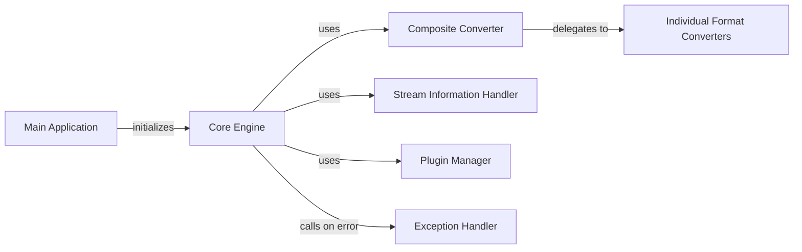

## Component Details

One paragraph explaining the functionality which is represented by this graph. What the main flow is and what is its purpose.

### Core Engine
Manages the conversion process. Initializes the CompositeConverter and PluginManager, orchestrates the conversion workflow using the convert method.

**Related Classes/Methods**:

- <a href="https://github.com/microsoft/markitdown/blob/master/packages/markitdown/src/markitdown/_markitdown.py#L92-L770" target="_blank" rel="noopener noreferrer">`markitdown._markitdown.MarkItDown` (92:770)</a>

### Composite Converter
Aggregates individual format converters. Its convert method likely iterates through converters, selecting the appropriate one based on the input stream_info.

**Related Classes/Methods**:

- `markitdown.converters.CompositeConverter` (1:10)

### Individual Format Converters
Handles conversion to a specific format (e.g., DOCX, EPUB, HTML). These would have convert methods specific to their format.

**Related Classes/Methods**:

- `markitdown.converters.DocxConverter` (1:10)
- `markitdown.converters.EpubConverter` (1:10)
- `markitdown.converters.HtmlConverter` (1:10)

### Stream Information Handler
Provides metadata (charset, file type) about the input stream.

**Related Classes/Methods**:

- <a href="https://github.com/microsoft/markitdown/blob/master/packages/markitdown/src/markitdown/_stream_info.py#L5-L31" target="_blank" rel="noopener noreferrer">`markitdown._stream_info.StreamInfo` (5:31)</a>

### Plugin Manager
Loads and manages plugins, extending the core functionality.

**Related Classes/Methods**:

- `markitdown.plugin_manager.PluginManager` (1:10)

### Exception Handler
Handles errors during the conversion process.

**Related Classes/Methods**:

- `markitdown.exception_handler.ExceptionHandler` (1:10)

### Main Application
Application entry point; parses command-line arguments, initializes the Core Engine, and runs the conversion.

**Related Classes/Methods**:

- <a href="https://github.com/microsoft/markitdown/blob/master/packages/markitdown/src/markitdown/__main__.py#L1-L10" target="_blank" rel="noopener noreferrer">`markitdown.__main__` (1:10)</a>

### [FAQ](https://github.com/CodeBoarding/GeneratedOnBoardings/tree/main?tab=readme-ov-file#faq)