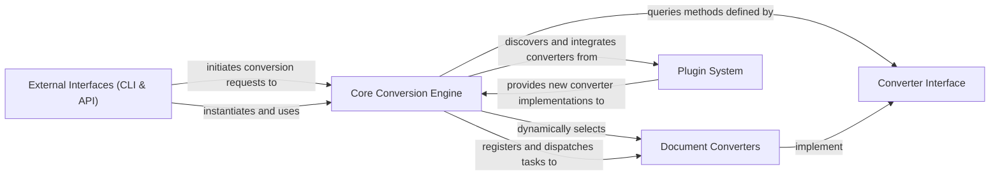

## Details

The `markitdown` architecture is centered around a `Core Conversion Engine` that orchestrates document transformations. This engine acts as a facade, providing a unified API for conversion, and leverages a microkernel/plugin architecture for extensibility. Users interact with the system through `External Interfaces`, either a Command-Line Interface (CLI) or a web-based Markitdown Control Plane (MCP) Application, both of which invoke the `Core Conversion Engine`. The engine dynamically selects the appropriate `Document Converter` for a given input type by querying implementations of the `Converter Interface`. This interface defines a standard contract, enabling new `Document Converters` to be easily integrated via the `Plugin System`, allowing the library to support a wide array of input formats and sources.

### Core Conversion Engine [[Expand]](./Core_Conversion_Engine.md)
The central orchestrator of the document conversion process. It manages input sources, selects appropriate converters, and provides the primary API for conversion. It embodies the Facade pattern for the overall process and the Microkernel for plugin management.

**Related Classes/Methods**:

- `packages.markitdown.src.markitdown._markitdown.py` (1:1)

### Converter Interface [[Expand]](./Converter_Interface.md)
Defines the standardized contract (`accepts`, `convert`) that all specific document converters must adhere to. This interface is crucial for enabling the Strategy pattern, allowing the Core Conversion Engine to dynamically select and execute the correct converter.

**Related Classes/Methods**:

- `packages.markitdown.src.markitdown._base_converter.py` (1:1)

### Document Converters [[Expand]](./Document_Converters.md)
A collection of specialized modules, each encapsulating the logic and dependencies required to convert a specific document format (e.g., PDF, DOCX, Images) or data source (e.g., YouTube, RSS) into Markdown. These act as concrete strategies or plugins, implementing the `Converter Interface`.

**Related Classes/Methods**:

- `packages.markitdown.src.markitdown.converters._pdf_converter.py` (1:1)
- `packages.markitdown.src.markitdown.converters._docx_converter.py` (1:1)
- `packages.markitdown.src.markitdown.converters._image_converter.py` (1:1)
- `packages.markitdown.src.markitdown.converters._youtube_converter.py` (1:1)

### External Interfaces (CLI & API)
Serves as the user-facing entry points for the `markitdown` library. This component includes both the Command-Line Interface for direct user interaction and the Markitdown Control Plane (MCP) Application, which exposes the conversion capabilities as an HTTP API. Both layers primarily interact with the `Core Conversion Engine`.

**Related Classes/Methods**:

- `packages.markitdown.src.markitdown.__main__.py` (1:1)
- `packages.markitdown-mcp.src.markitdown_mcp.__main__.py` (1:1)

### Plugin System [[Expand]](./Plugin_System.md)
Manages the extensibility of the `markitdown` system. This includes the mechanisms within the `Core Conversion Engine` for discovering, loading, and registering external converters, as well as providing a framework and examples (like the Sample Plugin) for third-party developers to create and integrate their own custom converters.

**Related Classes/Methods**:

- `packages.markitdown.src.markitdown._markitdown.py` (1:1)
- `packages.markitdown-sample-plugin.src.markitdown_sample_plugin._plugin.py` (1:1)

### [FAQ](https://github.com/CodeBoarding/GeneratedOnBoardings/tree/main?tab=readme-ov-file#faq)