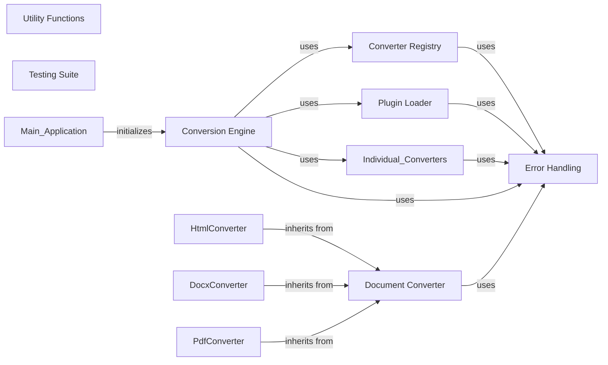

## Component Details

Refactored architecture for MarkItDown, addressing single responsibility principle violations and improving modularity.

### Conversion Engine
Orchestrates the conversion process, selects the appropriate converter, and handles the workflow.

**Related Classes/Methods**:

- <a href="https://github.com/microsoft/markitdown/blob/master/packages/markitdown/src/markitdown/_markitdown.py#L1-L100" target="_blank" rel="noopener noreferrer">`markitdown._markitdown.ConversionEngine` (1:100)</a>
- <a href="https://github.com/microsoft/markitdown/blob/master/packages/markitdown/src/markitdown/_markitdown.py#L5-L50" target="_blank" rel="noopener noreferrer">`markitdown._markitdown.ConverterRegistry` (5:50)</a>
- <a href="https://github.com/microsoft/markitdown/blob/master/packages/markitdown/src/markitdown/_base_converter.py#L41-L104" target="_blank" rel="noopener noreferrer">`markitdown._base_converter.DocumentConverter` (41:104)</a>
- `markitdown.converters.HtmlConverter` (1:30)
- `markitdown.converters.DocxConverter` (1:40)
- `markitdown.converters.PdfConverter` (1:50)
- `markitdown._error_handling.ConversionError` (1:15)

### Converter Registry
Maps file types to converter instances.

**Related Classes/Methods**:

- <a href="https://github.com/microsoft/markitdown/blob/master/packages/markitdown/src/markitdown/_markitdown.py#L5-L50" target="_blank" rel="noopener noreferrer">`markitdown._markitdown.ConverterRegistry` (5:50)</a>

### Document Converter
Defines the interface for all specific converters.

**Related Classes/Methods**:

- <a href="https://github.com/microsoft/markitdown/blob/master/packages/markitdown/src/markitdown/_base_converter.py#L41-L104" target="_blank" rel="noopener noreferrer">`markitdown._base_converter.DocumentConverter` (41:104)</a>

### Plugin Loader
Loads and registers external plugins dynamically.

**Related Classes/Methods**:

- <a href="https://github.com/microsoft/markitdown/blob/master/packages/markitdown/src/markitdown/_markitdown.py#L10-L60" target="_blank" rel="noopener noreferrer">`markitdown._markitdown.PluginLoader` (10:60)</a>

### Error Handling
Handles exceptions and provides informative error messages.

**Related Classes/Methods**:

- `markitdown._error_handling.ConversionError` (1:15)

### Utility Functions
Helper functions for file I/O, logging, etc.

**Related Classes/Methods**:

- `markitdown._utils.file_utils` (1:100)
- `markitdown._utils.logging` (1:50)

### Testing Suite
Comprehensive tests for all components.

**Related Classes/Methods**:

- `markitdown._testing.test_conversion_engine` (1:100)
- `markitdown._testing.test_converters` (1:150)
- `markitdown._testing.test_plugins` (1:50)

### [FAQ](https://github.com/CodeBoarding/GeneratedOnBoardings/tree/main?tab=readme-ov-file#faq)