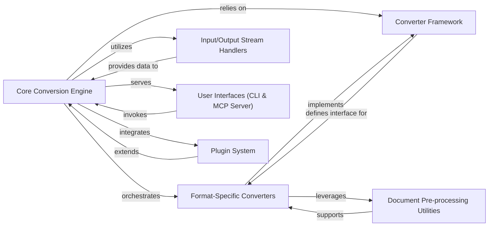

## Details

The `markitdown` project is designed as a modular document conversion system. Its core functionality revolves around the `Core Conversion Engine`, which orchestrates the conversion process by utilizing a flexible `Converter Framework`. This framework defines a standard interface that `Format-Specific Converters` implement to handle various document types. Input and output operations are managed by `Input/Output Stream Handlers`, ensuring data is correctly ingested and emitted. Users interact with the system through `User Interfaces`, which can be a Command-Line Interface or a server. The system's extensibility is facilitated by a `Plugin System`, allowing dynamic addition of new conversion capabilities. Additionally, `Document Pre-processing Utilities` assist in preparing content before the main conversion.

### Core Conversion Engine
The central orchestrator managing conversion workflows, converter registration, and selection.

**Related Classes/Methods**:

### Converter Framework
Defines the standard interface (`DocumentConverter`) for all format-specific converters.

**Related Classes/Methods**:

### Format-Specific Converters
Modules specialized in converting particular document formats to Markdown.

**Related Classes/Methods**:

### Input/Output Stream Handlers
Manages various input data streams, extracts metadata, and handles output.

**Related Classes/Methods**:

### User Interfaces (CLI & MCP Server)
Provides direct command-line interaction and a web service interface for conversion requests.

**Related Classes/Methods**:

### Plugin System
Enables dynamic extension of conversion capabilities through external modules.

**Related Classes/Methods**:

### Document Pre-processing Utilities
Offers specialized functions to prepare document content before main conversion.

**Related Classes/Methods**:

### [FAQ](https://github.com/CodeBoarding/GeneratedOnBoardings/tree/main?tab=readme-ov-file#faq)