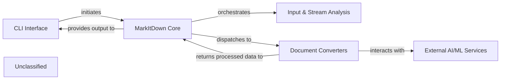

## Details

The `markitdown` application is structured around a core orchestration engine, the `MarkItDown Core`, which is initiated by the `CLI Interface`. The `MarkItDown Core` is responsible for intelligently handling diverse input sources, including fetching web content via its integrated HTTP client functionality, and then leveraging the `Input & Stream Analysis` component to determine the appropriate processing strategy. It then dispatches the content to specialized `Document Converters`, which are designed to transform various formats into Markdown. Some of these converters extend their capabilities by interacting with `External AI/ML Services` for advanced content extraction and analysis. The processed Markdown output is ultimately returned through the `MarkItDown Core` back to the `CLI Interface` for presentation to the user.

### CLI Interface [[Expand]](./CLI_Interface.md)
The entry point for users, handling command-line arguments, orchestrating the main application flow, and presenting the final Markdown output.

**Related Classes/Methods**:

- <a href="https://github.com/microsoft/markitdown/blob/main/packages/markitdown/src/markitdown/__main__.py" target="_blank" rel="noopener noreferrer">`markitdown.__main__`</a>

### MarkItDown Core [[Expand]](./MarkItDown_Core.md)
The central processing unit and facade of the application. It manages conversion requests, handles diverse input sources (local files, URIs, streams), directly manages external HTTP/HTTPS requests for fetching web content using an internal `requests` session, orchestrates stream analysis, dispatches conversion tasks to appropriate converters, and manages converter registration (including plugins).

**Related Classes/Methods**:

- <a href="https://github.com/microsoft/markitdown/blob/main/packages/markitdown/src/markitdown/_markitdown.py" target="_blank" rel="noopener noreferrer">`markitdown._markitdown`</a>

### Input & Stream Analysis [[Expand]](./Input_Stream_Analysis.md)
Dedicated to analyzing incoming data streams to accurately determine file types, character encodings, and other crucial metadata required for appropriate converter selection.

**Related Classes/Methods**:

- <a href="https://github.com/microsoft/markitdown/blob/main/packages/markitdown/src/markitdown/_stream_info.py" target="_blank" rel="noopener noreferrer">`markitdown._stream_info`</a>

### Document Converters [[Expand]](./Document_Converters.md)
A comprehensive collection of specialized modules, each designed to parse and transform content from a specific input format (e.g., PDF, DOCX, HTML, YouTube, audio) into a standardized Markdown representation. This component encapsulates all format-specific conversion logic and includes clients for external AI/ML services.

**Related Classes/Methods**:

- <a href="https://github.com/microsoft/markitdown/blob/main/packages/markitdown/src/markitdown/converters/_csv_converter.py" target="_blank" rel="noopener noreferrer">`markitdown.converters._csv_converter`</a>
- <a href="https://github.com/microsoft/markitdown/blob/main/packages/markitdown/src/markitdown/converters/_html_converter.py" target="_blank" rel="noopener noreferrer">`markitdown.converters._html_converter`</a>
- <a href="https://github.com/microsoft/markitdown/blob/main/packages/markitdown/src/markitdown/converters/_doc_intel_converter.py" target="_blank" rel="noopener noreferrer">`markitdown.converters._doc_intel_converter`</a>
- <a href="https://github.com/microsoft/markitdown/blob/main/packages/markitdown/src/markitdown/converters/_transcribe_audio.py" target="_blank" rel="noopener noreferrer">`markitdown.converters._transcribe_audio`</a>

### External AI/ML Services [[Expand]](./External_AI_ML_Services.md)
Represents the external cloud-based AI/ML APIs (e.g., Azure Document Intelligence, OpenAI) that `Document Converters` interact with for advanced document analysis, media processing, and content extraction.

**Related Classes/Methods**:

- <a href="https://github.com/microsoft/markitdown/blob/main/packages/markitdown/src/markitdown/converters/_doc_intel_converter.py" target="_blank" rel="noopener noreferrer">`markitdown.converters._doc_intel_converter`</a>
- <a href="https://github.com/microsoft/markitdown/blob/main/packages/markitdown/src/markitdown/converters/_transcribe_audio.py" target="_blank" rel="noopener noreferrer">`markitdown.converters._transcribe_audio`</a>

### Unclassified
Component for all unclassified files and utility functions (Utility functions/External Libraries/Dependencies)

**Related Classes/Methods**: _None_

### [FAQ](https://github.com/CodeBoarding/GeneratedOnBoardings/tree/main?tab=readme-ov-file#faq)